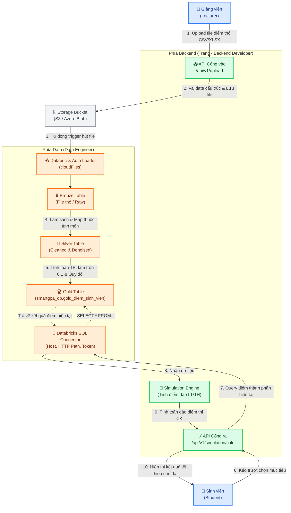

# SMARTGPA – BẢN THIẾT KẾ LUỒNG DỮ LIỆU CHUẨN (DATA FLOW DESIGN)

Tài liệu này xác lập quy trình phối hợp kỹ thuật chi tiết giữa bộ phận **Data (Data Engineer)** và **Backend (Trang - Backend Developer)** cho dự án SmartGPA. Đây là bản thiết kế chuẩn (Single Source of Truth) để hai bên thống nhất giao diện dữ liệu, cách thức vận hành và phân định trách nhiệm.

---

## 🗺️ SƠ ĐỒ LUỒNG DỮ LIỆU TỔNG QUAN (DATA FLOW ARCHITECTURE)



---

## 1. PHÍA DATA (DATA ENGINEER)
Nhiệm vụ của DE là tiếp nhận dữ liệu điểm thô, chuyển đổi chúng qua mô hình Medallion (Bronze $\rightarrow$ Silver $\rightarrow$ Gold) để cung cấp dữ liệu "sạch", chuẩn hóa cao cho Backend truy vấn tức thời.

### Bước 1: Hạ tầng & Tiếp nhận (Ingestion)
* **Storage Bucket:** Cung cấp bucket lưu trữ (S3 trên AWS hoặc Azure Blob Storage) với cấu trúc thư mục phân tách rõ ràng (ví dụ: `/raw/diem/`).
* **Auto Loader (`cloudFiles`):** Cấu hình Databricks Spark Streaming lắng nghe thư mục trên bucket. Khi có file điểm mới xuất hiện, hệ thống tự động nạp (incremental load) mà không cần lập lịch cron định kỳ.

### Bước 2: Chuỗi xử lý Medallion (Medallion Architecture)
* **Bronze Table:** Lưu trữ nguyên bản (raw schema) của file CSV/Excel kèm theo siêu dữ liệu (metadata: tên file, thời gian nạp).
* **Silver Table:**
  * Kiểm tra trùng lặp (`student_id`, `ma_mon`, `ma_lop_hoc_phan`).
  * Xử lý dữ liệu khuyết thiếu (Null-value handling), ép kiểu dữ liệu chuẩn (Casting `float`, `string`).
  * Liên kết với bảng thuộc tính môn học (Subjects) để xác định cấu trúc học phần (`loai_hoc_phan` là Lý thuyết, Thực hành hay Tích hợp).
* **Gold Table (`smartgpa_db.gold_diem_sinh_vien`):**
  * Áp dụng quy chế làm tròn điểm tổng kết đến **0.1**.
  * Tự động quy đổi thang điểm chữ (A+ đến F) và thang điểm 4 theo đúng quy định chung của Nhà trường.
  * **Cấu trúc bảng Gold chuẩn bàn giao:**
    | Tên Cột | Kiểu Dữ Liệu | Ý Nghĩa | Ghi Chú |
    | :--- | :--- | :--- | :--- |
    | `student_id` | `STRING` | Mã số sinh viên | Khóa chính (Composite Key) |
    | `ma_mon` | `STRING` | Mã môn học | Khóa chính (Composite Key) |
    | `ma_lop_hoc_phan` | `STRING` | Mã lớp học phần | Phục vụ filter theo lớp |
    | `diem_thong_thuong` | `DOUBLE` | Điểm thường kỳ | Điểm thành phần |
    | `diem_giua_ky` | `DOUBLE` | Điểm thi giữa kỳ | Điểm thành phần |
    | `diem_cuoi_ky` | `DOUBLE` | Điểm thi cuối kỳ | Null nếu chưa thi |
    | `diem_tong_ket_10`| `DOUBLE` | Điểm tổng kết hệ 10 | Làm tròn 0.1 |
    | `diem_he_4` | `DOUBLE` | Điểm tổng kết hệ 4 | 0.0 đến 4.0 |
    | `diem_chu` | `STRING` | Điểm chữ quy đổi | A+, A, B+, B, C+, C, D+, D, F |
    | `loai_hoc_phan` | `STRING` | Loại hình môn học | `ly_thuyet`, `thuc_hanh`, `tich_hop` |
    | `so_chi_lt` | `INT` | Số tín chỉ lý thuyết | Dùng để tính điểm tích hợp |
    | `so_chi_th` | `INT` | Số tín chỉ thực hành | Dùng để tính điểm tích hợp |
    | `tong_so_chi` | `INT` | Tổng số tín chỉ môn | `so_chi_lt + so_chi_th` |
    | `status_canh_bao` | `STRING` | Cảnh báo học vụ | `An toan` hoặc `Nguy co` |

### Bước 3: Cung cấp API nội bộ cho Backend
* Cung cấp endpoint kết nối **Databricks SQL Warehouse**:
  * `DATABRICKS_HOST` (Hostname của workspace)
  * `DATABRICKS_HTTP_PATH` (HTTP Path của SQL Warehouse)
  * `DATABRICKS_TOKEN` (Tài khoản máy ảo/Service Principal bảo mật cao)
* Câu truy vấn SQL cố định tối ưu hiệu năng:
  ```sql
  SELECT 
      student_id, ma_mon, diem_thong_thuong, diem_giua_ky, diem_cuoi_ky,
      loai_hoc_phan, so_chi_lt, so_chi_th, tong_so_chi, status_canh_bao
  FROM smartgpa_db.gold_diem_sinh_vien 
  WHERE student_id = ? AND ma_mon = ?
  LIMIT 1;
  ```

---

## 2. PHÍA BACKEND (TRANG - BACKEND DEVELOPER)
Nhiệm vụ của Trang là thiết lập cầu nối API bảo mật giữa giao diện Web Client và hạ tầng dữ liệu Databricks, đồng thời thực thi công cụ tính toán đảo điểm cuối kỳ (Simulation Engine).

### Bước 1: Upload Hub – Tiếp nhận file điểm thô
* Viết Endpoint: `POST /api/v1/upload` (Yêu cầu quyền `lecturer` hoặc `admin`).
* **Logic xử lý:**
  1. Kiểm tra định dạng file gửi lên (chỉ chấp nhận `.csv` hoặc `.xlsx`).
  2. Validate cấu trúc cột bắt buộc trong file (nếu thiếu cột hoặc dữ liệu sai định dạng $\rightarrow$ trả về ngay lỗi `422 Unprocessable Entity` kèm thông tin lỗi chi tiết).
  3. Để tránh ghi đè file trên Cloud Storage, Backend sẽ đổi tên file theo định dạng:
     `diem_thao_[ma_lop_hoc_phan]_[timestamp]_[uuid].csv`
  4. Đẩy file "sạch cấu trúc" này lên Storage Bucket tại đường dẫn đã thỏa thuận với DE.

### Bước 2: Simulation Service – Giả lập điểm cuối kỳ mục tiêu
* Viết Endpoint: `POST /api/v1/simulation/calc` (Yêu cầu quyền `student` hoặc `admin`).
* **Input Request Schema:**
  ```json
  {
    "student_id": "SV123456",
    "ma_mon": "INT1306",
    "diem_chu_muc_tieu": "A"
  }
  ```
* **Logic xử lý:**
  1. Sử dụng thư viện `databricks-sql-connector` kết nối đến Databricks SQL Warehouse bằng thông số từ `.env`.
  2. Thực thi câu truy vấn SQL (ở Mục 1 - Bước 3) để lấy thông tin điểm hiện tại và cấu trúc môn học của sinh viên.
  3. Tra cứu điểm tổng kết tối thiểu tương ứng với `diem_chu_muc_tieu` từ bảng quy chuẩn (ví dụ: mục tiêu `A` $\rightarrow$ điểm tổng kết hệ 10 cần tối thiểu là `8.5`).
  4. Thực thi thuật toán tính điểm đảo tùy theo loại học phần (`loai_hoc_phan`):
     * **Môn Lý thuyết (T = 0.2 × TK + 0.3 × GK + 0.5 × CK):**
       $$\text{diem\_cuoi\_ky\_min} = \frac{T_{target} - 0.2 \times \text{diem\_thong\_thuong} - 0.3 \times \text{diem\_giua\_ky}}{0.5}$$
     * **Môn Thực hành:** Điểm thực hành là trung bình cộng các bài. Báo cáo điểm trung bình thực hành cần đạt.
     * **Môn Tích hợp (T = (LT × so\_chi\_lt + TH × so\_chi\_th) / tong\_so\_chi):**
       Tính ngược số điểm thi lý thuyết cần đạt khi biết trước điểm thực hành (hoặc ngược lại).
  5. **Kiểm tra tính khả thi:** Nếu kết quả tính ra `diem_cuoi_ky_min > 10.0` $\rightarrow$ Trả về nhãn `"Bất khả thi"`.
  6. **Output Response Schema:**
     ```json
     {
       "student_id": "SV123456",
       "ma_mon": "INT1306",
       "diem_chu_muc_tieu": "A",
       "diem_cuoi_ky_min": 8.5,
       "kha_thi": true,
       "message": "Bạn cần đạt tối thiểu 8.5 điểm thi cuối kỳ môn này để đạt điểm tổng kết loại A."
     }
     ```

### Bước 3: Cấu hình bảo mật (.env)
Quản lý bảo mật các khóa kết nối trong file `.env` cục bộ trên Server, tuyệt đối không push file `.env` này lên Git repository.
```env
# Databricks Connection Configuration
DATABRICKS_HOST=https://your-workspace.azuredatabricks.net
DATABRICKS_HTTP_PATH=/sql/1.0/warehouses/your-warehouse-id
DATABRICKS_TOKEN=dapi_your_service_principal_token_here
DATABRICKS_CATALOG=smartgpa
DATABRICKS_SCHEMA=academic
```

---

## 3. BẢNG PHỐI HỢP CHI TIẾT (WORK COLLABORATION CHECKLIST)

| STT | Nhiệm vụ cụ thể | Người phụ trách | Đích đến & Tiêu chí nghiệm thu | Trạng thái |
|:---:|:---|:---:|:---|:---:|
| **1** | Cấu hình Cloud Storage Bucket & phân quyền IAM | **DE (Bạn)** | Bucket hoạt động, Backend có quyền write, Databricks có quyền read. | `Ready` |
| **2** | Thống nhất định dạng file Excel/CSV mẫu | **Cả hai** | Có file `template_diem_thao.csv` chuẩn để làm mẫu cho Giảng viên. | `Ready` |
| **3** | Xây dựng API `/api/v1/upload` & Validate cấu trúc file | **Trang (BE)** | Chặn file lỗi cấu trúc ngay lập tức, đổi tên file và upload lên Bucket. | `In Progress` |
| **4** | Viết code Databricks Auto Loader (`cloudFiles`) nạp Bronze | **DE (Bạn)** | File upload lên Bucket được tự động nạp vào Bronze Delta Table trong < 5 giây. | `Ready` |
| **5** | Viết Spark ETL Notebook xử lý Silver & Gold | **DE (Bạn)** | Dữ liệu được làm sạch, tính toán, quy đổi chính xác theo thang điểm và lưu vào Gold. | `Ready` |
| **6** | Cấp thông số kết nối và phân quyền Service Principal | **DE (Bạn)** | Tạo account robot bảo mật, bàn giao Host, HTTP Path, Token cho Trang. | `Ready` |
| **7** | Cài đặt `databricks-sql-connector` và viết Module kết nối | **Trang (BE)** | Tích hợp thư viện vào `requirements.txt`, kết nối thành công tới Gold Table. | `In Progress` |
| **8** | Triển khai logic tính toán đảo trong Simulation Service | **Trang (BE)** | API `/api/v1/simulation/calc` hoạt động ổn định, tính toán đúng 3 loại học phần. | `In Progress` |
| **9** | Kiểm thử liên thông toàn diện (End-to-End Test) | **Cả hai** | Upload file $\rightarrow$ Databricks xử lý $\rightarrow$ Giả lập điểm chữ $\rightarrow$ Khớp kết quả. | `Planned` |

---

## 💡 NGUYÊN TẮC VÀNG ĐỂ PHỐI HỢP THÀNH CÔNG

1. **Chặn lỗi từ cửa ngõ (Fail-Fast):** Trang (Backend) chịu trách nhiệm validate định dạng file và kiểu dữ liệu ở API Upload. Nếu file lỗi, tuyệt đối không đẩy lên Bucket. DE sẽ yên tâm xây dựng pipeline xử lý mà không sợ gặp dữ liệu rác gây crash hệ thống.
2. **Ủy thác Token an toàn:** Không bao giờ chia sẻ token cá nhân. DE sẽ tạo một **Service Principal** trên Databricks và cấp quyền tối giản (chỉ được `SELECT` bảng `gold_diem_sinh_vien`) để đảm bảo bảo mật tối đa.
3. **Đồng bộ hóa tên gọi trường dữ liệu:** Mọi sự thay đổi về tên cột trong bảng Gold hoặc định dạng file upload phải được sự đồng ý và cập nhật đồng thời ở cả hai phía để tránh vỡ hệ thống.

---
*Bản thiết kế này đã được thống nhất và sẵn sàng đưa vào triển khai thực tế.*
