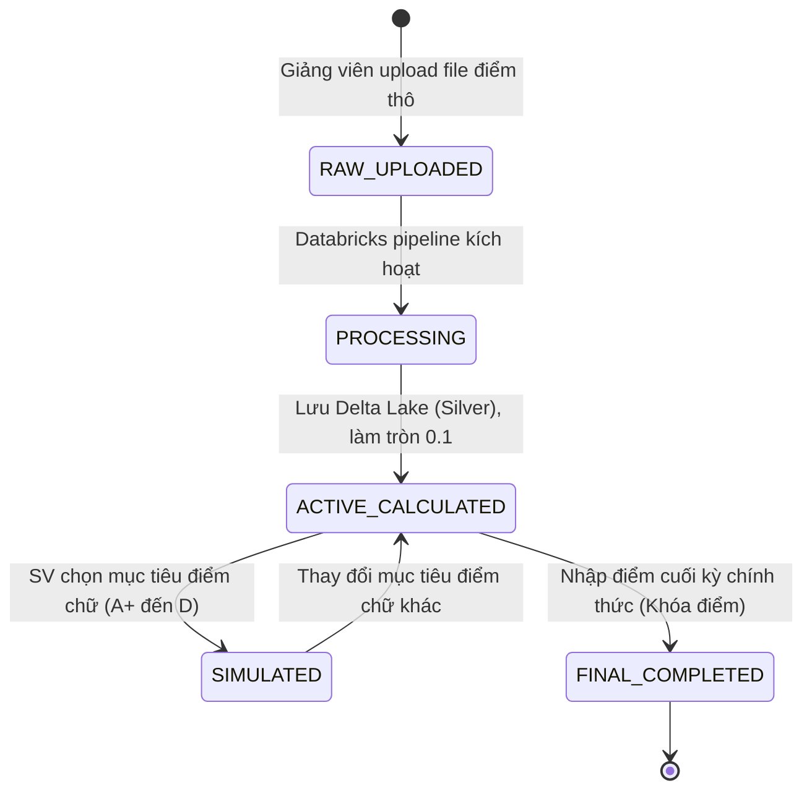
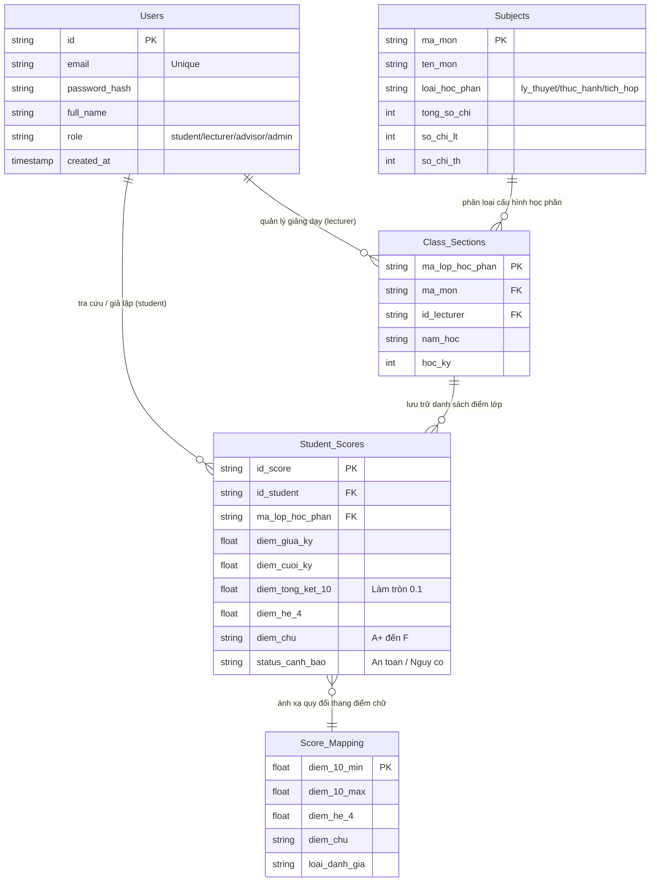
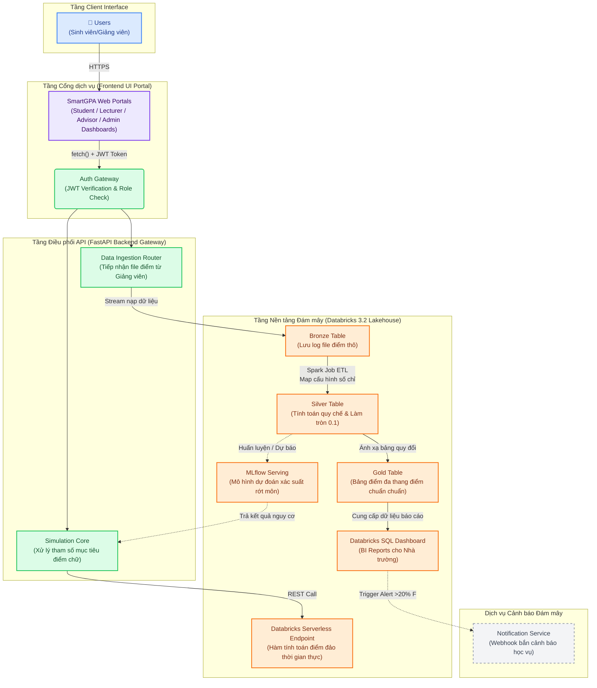

---

# PROJECT PROPOSAL

## THÔNG TIN CHUNG

### Thành viên nhóm

| STT | Họ và tên                        | MSSV      | Vai trò                        |
|-----|----------------------------------|-----------|------------------------------- |
| 1   |                                  |           | Leader / SOA Backend Architect |
| 2   | Nguyễn Văn A                     | [MSSV]    | Data Engineer                  |
| 3   | Trần Thị B                       | [MSSV]    | ML / Cloud Engineer            |
| 4   | Lê Hoàng D                       | [MSSV]    | Frontend Developer             |
| 5   | Phạm Minh E                      | [MSSV]    | QA / Data Analyst              |

- **Git Repository**: [https://github.com/TruongTheHaiThinh/SmartGPA-Academic-Analytics-Platform](https://github.com/TruongTheHaiThinh/SmartGPA-Academic-Analytics-Platform)

---

### Cấu trúc nhánh Git & Chức năng

| Nhánh                        | Chức năng/Module                                            | Người phụ trách             |
|------------------------------|-------------------------------------------------------------|-----------------------------|
| `feature/auth-gateway`       | Xác thực, phân quyền JWT (4 vai trò), API Gateway           | Chan                        |
| `feature/databricks-pipeline`| Hạ tầng Delta Lake, Pipeline ETL nạp điểm thô               | Nguyễn Văn A                |
| `feature/simulation-engine`  | Logic core tính điểm đảo (LT/TH/Tích hợp)                   | Chan                        |
| `feature/ml-prediction`      | MLflow Model dự báo rớt môn (Điểm F)                        | Trần Thị B                  |
| `feature/client-portal`      | Giao diện Web UI tích hợp thanh trượt giả lập               | Lê Hoàng D                  |
| `feature/analytics-dashboard`| Kiểm thử Pytest & Databricks SQL Dashboard                  | Vy                          |
| `develop`                    | Tích hợp tất cả các feature branch (code ổn định đã review) | Cả nhóm                     |
| `main`                       | Push cuối cùng – Bản hoàn chỉnh để nộp & deploy             | Cả nhóm                     |

> **Quy trình làm việc:**
> - Mỗi thành viên làm việc trên nhánh `feature/*` được phân công.
> - Khi hoàn thành module tạo PR vào `develop`, leader review & approve.
> - Chỉ merge duy nhất 1 lần vào `main` khi toàn hệ thống ổn định, không commit trực tiếp vào `main`.

---

# MÔ TẢ DỰ ÁN: SMARTGPA – HỆ THỐNG PHÂN TÍCH HỌC THUẬT, GIẢ LẬP ĐIỂM MỤC TIÊU VÀ DỰ BÁO CẢNH BÁO HỌC VỤ

## 1. Ý TƯỞNG DỰ ÁN (THE VISION)

**Tổng quan nền tảng**

Trong kỷ nguyên giáo dục số, việc kết nối dữ liệu học thuật giữa Nhà trường và Sinh viên thường gặp tình trạng rời rạc, thiếu tính dự báo thời gian thực. Nhóm chúng tôi quyết định xây dựng **SmartGPA** – một nền tảng hướng dịch vụ (SOA) kết hợp điện toán đám mây nhằm ứng dụng dữ liệu điểm số khổng lồ thành các thông tin phân tích có giá trị định hướng hành động. Hệ thống đóng vai trò như một **"Trung tâm phân tích và dự báo học thuật thông minh"** cho các trường đại học.

**3 Trụ cột kỹ thuật của SmartGPA:**

* **Service-Oriented Architecture (SOA):** Tách biệt và module hóa hoàn toàn giữa tầng giao diện người dùng (Frontend Portal), hệ thống định tuyến trung tâm (FastAPI Backend Gateway) và công cụ xử lý dữ liệu đám mây (Databricks Core).
* **Inverse Calculation Engine (Thuật toán tính điểm đảo):** Tự động bóc tách loại học phần (Lý thuyết, Thực hành, Tích hợp) theo đúng quy chế đào tạo, hỗ trợ sinh viên kéo chọn mục tiêu điểm chữ (A+ đến D) để tự động tính ngược ra số điểm thành phần/cuối kỳ tối thiểu cần đạt.
* **Predictive Analytics Table (Hồ sơ dự báo học vụ):** Ứng dụng kiến trúc Delta Lake (Bronze - Silver - Gold) và Machine Learning trên Databricks để phân tích tiến độ điểm số của hàng ngàn sinh viên, tự động gắn tag cảnh báo sớm nguy cơ rớt môn (Điểm F) giúp Cố vấn học tập chủ động can thiệp.

---

## 2. VAI TRÒ NGƯỜI DÙNG & PHÂN QUYỀN

Hệ thống được thiết kế phân quyền nghiêm ngặt với **4 vai trò người dùng** thông qua kiến trúc phân tầng bảo mật:

| **Vai trò** | **Tên gọi** | **Mô tả quyền hạn trên hệ thống** |
| --- | --- | --- |
| Sinh viên | Student | Tra cứu bảng điểm cá nhân; Sử dụng công cụ kéo trượt giả lập mục tiêu để xem gợi ý điểm thi cần đạt; Nhận thông báo cảnh báo học vụ. |
| Giảng viên | Lecturer | Quản lý học phần được phân công; Cấu hình thuộc tính môn học (số tín chỉ lý thuyết/thực hành); Upload file bảng điểm thành phần thô (CSV/Excel) của lớp. |
| Cố vấn học tập | Academic Advisor | Quản lý danh sách sinh viên lớp chủ nhiệm; Xem danh sách sinh viên bị hệ thống gắn cờ nguy cơ rớt môn; Nhận báo cáo phân tích học vụ tự động. |
| Admin Hệ thống | Đào tạo Admin | Quản lý tài khoản; Cấu hình các mốc điểm quy đổi thang điểm chữ (A+ đến F) toàn trường; Xem Dashboard tổng quan hiệu suất học tập toàn trường. |

---

## 3. CHI TIẾT NGHIỆP VỤ (BUSINESS LOGIC)

### 3.1 Quy trình xử lý điểm tổng thể

| **Bước** | **Tác nhân** | **Hành động nghiệp vụ hệ thống** |
| --- | --- | --- |
| 1 | Giảng viên | Khởi tạo lớp học phần → Cấu hình số tín chỉ (Mấy chỉ lý thuyết, mấy chỉ thực hành) → Tải lên file điểm thành phần (`diem_thao.csv`). |
| 2 | Hệ thống | API Backend tiếp nhận file, đẩy dữ liệu vào tầng **Bronze (Raw)** trên Databricks Delta Lake. |
| 3 | Databricks | Tự động kích hoạt Spark Job làm sạch dữ liệu, liên kết bảng cấu hình môn học để lấy trọng số và tính điểm trung bình hiện tại chuyển sang tầng **Silver**. |
| 4 | Hệ thống | Áp dụng quy chế làm tròn đến **một chữ số thập phân (0.1)** và ánh xạ tự động sang thang điểm 4 và thang điểm chữ (A+ đến F) lưu vào tầng **Gold**. |
| 5 | Sinh viên | Đăng nhập hệ thống → Xem bảng điểm hiện tại → Trình trạng học vụ hiển thị màu xanh (`An toàn`) hoặc nhấp nháy đỏ (`Nguy cơ rớt môn`). |
| 6 | Sinh viên | Kích hoạt lệnh Giả lập → Chọn mức điểm chữ mong muốn đạt được (Ví dụ: Loại A). |
| 7 | Hệ thống | Backend Gateway gọi Databricks Serverless Endpoint thực hiện thuật toán tính toán đảo để tìm số điểm tối thiểu cần đạt ở bài thi cuối kỳ. |
| 8 | Hệ thống | Trả về kết quả tức thì trên UI: *"Bạn cần đạt tối thiểu 8.8 điểm thi cuối kỳ nhánh lý thuyết để đạt loại A môn này"*. |
| 9 | Cố vấn | Truy cập Dashboard → Xem danh sách sinh viên thuộc diện cảnh báo học vụ dự báo sớm để tiến hành đôn đốc. |

### 3.2 Quy chế tính điểm chi tiết (Theo tài liệu trường)

Hệ thống tự động phân tách logic tính điểm tổng kết (T) dựa trên thuộc tính môn học do Giảng viên cấu hình:

1. **Học phần Lý thuyết:**

T = 20% × (ĐTB Thường kỳ) + 30% × (Điểm giữa kỳ) + 50% × (Điểm cuối kỳ)

2. **Học phần Thực hành:**

T = (Điểm thực hành_1 + Điểm thực hành_2 + ... + Điểm thực hành_x)/x

3. **Học phần Tích hợp (Cả lý thuyết và thực hành):**

T = ((Điểm lý thuyết × Số chỉ lý thuyết) + (Điểm thực hành × Số chỉ thực hành))/(Tổng số chỉ học phần)

### 3.3 State Machine – Vòng đời của một bản ghi điểm số

| **Trạng thái từ** | **Trạng thái đến** | **Điều kiện / Tác nhân kích hoạt** |
| --- | --- | --- |
| `[*] (Khởi tạo)` | RAW_UPLOADED | Giảng viên upload file bảng điểm thành phần thô lên hệ thống |
| RAW_UPLOADED | PROCESSING | Databricks Pipeline tự động kích hoạt nạp dữ liệu vào Delta Lake |
| PROCESSING | ACTIVE_CALCULATED | Hoàn thành tính toán ĐTB thành phần hiện tại, làm tròn đến 0.1 và phân loại ban đầu |
| ACTIVE_CALCULATED | SIMULATED | Sinh viên gọi lệnh giả lập chọn mục tiêu điểm mong muốn đạt được |
| SIMULATED | ACTIVE_CALCULATED | Sinh viên thay đổi mức điểm mục tiêu khác trên thanh trượt giao diện |
| ACTIVE_CALCULATED | FINAL_COMPLETED | Nhà trường cập nhật điểm thi cuối kỳ chính thức, khóa điểm vĩnh viễn (Read-only) |
| FINAL_COMPLETED | `[*]` | Cập nhật kết quả vào điểm trung bình tích lũy (GPA) tổng của sinh viên |

---

## 4. CHI TIẾT CÁC MODULE KỸ THUẬT

### Module 1: Quản lý Tài khoản & API Gateway (Chan phụ trách)

Quản lý vòng đời tài khoản và phân quyền truy cập cho hệ thống hướng dịch vụ. Hỗ trợ xác thực tập trung cho **4 vai trò** bằng cơ chế mã hóa mật khẩu `bcrypt` và chuỗi Token an toàn **JWT** (Access Token 30 phút + Refresh Token 7 ngày). Đóng vai trò là cổng Gateway tiếp nhận request từ Client để chuyển tiếp đến các dịch vụ xử lý dữ liệu.

### Module 2: Databricks Pipeline & Hạ tầng Delta Lake

Thiết lập hạ tầng xử lý dữ liệu lớn trên nền tảng **Databricks 3.2**. Xây dựng quy trình xử lý dữ liệu Medallion (Bronze: Lưu log file điểm thô; Silver: Làm sạch dữ liệu và map cấu hình tín chỉ học phần; Gold: Lưu trữ kết quả quy đổi đa thang điểm sẵn sàng phục vụ tra cứu).

### Module 3: Real-time Simulation Engine (Chan phụ trách)

Phát triển hệ thống API tính toán thời gian thực bằng **FastAPI**. Khi sinh viên kích hoạt thanh trượt chọn điểm chữ mục tiêu (A+ đến D), module này sẽ tự động tra cứu mốc giới hạn dưới từ tài liệu quy đổi `image_4.png` (Ví dụ mốc A là từ 8.5), thực hiện thuật toán đảo dựa trên cấu hình số chỉ lý thuyết/thực hành để trả về số điểm tối thiểu cần đạt với độ trễ cực thấp (<100ms).

### Module 4: Mô hình Máy học Dự báo Cảnh báo Học vụ

Sử dụng Databricks Notebook để huấn luyện mô hình phân loại (Random Forest/XGBoost) dựa trên tập dữ liệu lịch sử điểm số sinh viên khóa cũ. Đóng gói mô hình thông qua **MLflow** và triển khai dưới dạng **Databricks Serverless Real-time Endpoint** để phục vụ việc dự báo xác suất sinh viên dính điểm F (Rớt môn) dựa trên điểm thường kỳ hiện tại.

### Module 5: Cổng giao tiếp Client Portal

Phát triển giao diện ứng dụng Web UI responsive bằng React.js / Next.js chia làm 4 phân hệ cổng thông tin (Student, Lecturer, Advisor, Admin). Tích hợp các bộ kéo trượt giả lập điểm trực quan, kết nối Fetch API mượt mà đến Backend Gateway và ứng dụng thư viện Chart.js để hiển thị phổ điểm lớp học trực quan.

### Module 6: Databricks SQL Dashboard & Testing

Xây dựng tập dữ liệu lớn giả lập (Mock data) của 5.000 sinh viên để thực hiện load test hệ thống. Viết bộ mã kiểm thử tự động Pytest (Integration Test) cho các endpoint API chính để kiểm tra tính toàn vẹn dữ liệu. Thiết kế báo cáo trực quan trên **Databricks SQL Dashboard** giúp Admin theo dõi tỷ lệ cảnh báo học vụ toàn trường.

---

## PHÂN TÍCH & THIẾT KẾ SYSTEM

### 1. Yêu cầu chức năng hệ thống – Phân loại MoSCoW

#### Nhóm MUST-HAVE (Bắt buộc – MVP):

* Hệ thống xác thực đăng ký/đăng nhập phân quyền rõ ràng cho 4 vai trò bằng mã hóa bảo mật JWT.
* **Giảng viên:** Cấu hình thuộc tính học phần (Số tín chỉ lý thuyết, thực hành) và upload file điểm thành phần.
* **Sinh viên:** Tra cứu điểm thành phần hiện tại, kéo trượt giả lập mục tiêu để nhận ngay gợi ý điểm thi cần đạt.
* **Hệ thống xử lý đám mây:** Đồng bộ hóa quy chế tính điểm 3 loại học phần (Lý thuyết, Thực hành, Tích hợp), làm tròn điểm số đến 0.1 và tự động ánh xạ sang điểm chữ (A+ đến F) cùng điểm hệ 4 dựa trên tài liệu quy chuẩn `image_4.png`.
* Tự động hiển thị nhãn `Cảnh báo học vụ` nếu điểm số dự báo rơi vào thang điểm loại F (0.0 - 3.9).

#### Nhóm SHOULD-HAVE:

* Tích hợp mô hình máy học trên Databricks để hiển thị tỷ lệ % xác suất rớt môn của sinh viên thay vì chỉ dùng công thức tính toán tĩnh.
* Tự động kích hoạt Webhook bắn thông báo đến màn hình của Cố vấn học tập khi số lượng sinh viên trong lớp dính điểm cảnh báo vượt quá 20%.

#### Nhóm COULD-HAVE:

* Dashboard phân tích nâng cao, so sánh hiệu suất học tập và phổ điểm giữa các khóa học hoặc các khoa đào tạo với nhau.

---

### 2. Yêu cầu Phi chức năng

* **Bảo mật & Tính nhất quán đám mây:**
  * Toàn bộ dữ liệu điểm số lưu trữ trên đám mây phải ứng dụng công nghệ Delta Lake để đảm bảo tính toàn vẹn dữ liệu thông qua cơ chế ACID Transactions.
  * Phân tách quyền truy cập dữ liệu nghiêm ngặt: Sinh viên tuyệt đối không có quyền chỉnh sửa dữ liệu điểm gốc trên Delta Lake, chỉ được quyền gửi yêu cầu tính toán sang Simulation Engine.

* **Hiệu năng:**
  * Điểm chạm API phục vụ giả lập điểm thời gian thực (Simulation Request) phải đạt tốc độ xử lý và phản hồi dưới 150ms để đảm bảo trải nghiệm mượt mà khi sinh viên thao tác kéo trượt trên giao diện.

* **Tính bảo trì:**
  * Source code Backend FastAPI tổ chức theo kiến trúc phân tầng chuẩn dịch vụ (Router → Service → Databricks Call Layer), độc lập hoàn toàn với mã nguồn tính toán xử lý dữ liệu lớn (Spark Notebook) trên Databricks.

---

### 3. Mô hình Thực thể Dữ liệu (Lược đồ mức Logic trên Delta Lake)

Hệ thống lưu trữ cấu trúc hóa dữ liệu trên Delta Lake thông qua 5 thực thể cốt lõi:

| **Thực thể dữ liệu** | **Mô tả các trường thông tin chính** |
| --- | --- |
| **Users** | `id` (PK), `email` (Unique), `password_hash`, `full_name`, `role` (student/lecturer/advisor/admin), `is_active`, `created_at` |
| **Subjects (Cấu hình môn)** | `ma_mon` (PK), `ten_mon`, `loai_hoc_phan` (ly_thuyet/thuc_hanh/tich_hop), `tong_so_chi`, `so_chi_lt`, `so_chi_th` |
| **Class_Sections (Lớp)** | `ma_lop_hoc_phan` (PK), `ma_mon` (FK), `id_lecturer` (FK), `nam_hoc`, `hoc_ky` |
| **Student_Scores (Bảng điểm)** | `id_score` (PK), `id_student` (FK), `ma_lop_hoc_phan` (FK), `diem_thong_thuong` (Array/List), `diem_giua_ky`, `diem_cuoi_ky`, `diem_tong_ket_10`, `diem_he_4`, `diem_chu`, `status_canh_bao` |
| **Score_Mapping (Quy đổi)** | `diem_10_min`, `diem_10_max`, `diem_he_4`, `diem_chu`, `loai_danh_gia` (Dat/Khong Dat) |

---

### 4. Sơ đồ Kiến trúc Hệ thống hướng Dịch vụ (SOA) trên Đám mây

---

## KẾ HOẠCH PHÁT TRIỂN DỰ ÁN (MVP PHASE)

**1. Kế hoạch kiểm thử dịch vụ tích hợp**

| Mã TC | Module dịch vụ | Hành động kiểm thử | Kết quả mong đợi tối ưu |
| --- | --- | --- | --- |
| TC-01 | Auth Gateway | Gọi endpoint yêu cầu giả lập điểm nhưng truyền token hết hạn hoặc sai quyền | Hệ thống trả về mã lỗi `401 Unauthorized` hoặc `403 Forbidden`. |
| TC-02 | Ingestion Service | Giảng viên upload file danh sách điểm định dạng không hợp lệ | Hệ thống chặn từ tầng Gateway, trả về `422 Unprocessable Entity`. |
| TC-03 | Data Rounding | Điểm tổng kết thực tế tính ra là 8.44 hoặc 8.46 | Databricks xử lý lưu vào Silver Table làm tròn chính xác thành 8.4 và 8.5. |
| TC-04 | Grade Mapping | Điểm học phần tính ra đạt mốc 8.0 | Hệ thống tự động map chính xác sang điểm hệ chữ **B+** và hệ 4 là **3.5** theo đúng `image_4.png`. |
| TC-05 | Inverse Calc (LT) | Môn Lý thuyết: Điểm TK=8.0, GK=9.0; Chọn mục tiêu đạt loại **A** (Mốc 8.5) | Simulation Engine tính đảo, trả về kết quả điểm cuối kỳ cần đạt tối thiểu là **8.5**. |
| TC-06 | Inverse Calc (TH) | Môn Tích hợp (2 chỉ LT, 1 chỉ TH): Điểm thực hành=8.0; Chọn mục tiêu đạt loại **A** (Mốc 8.5) | Simulation Engine tính toán đảo, thông báo điểm tổng kết nhánh lý thuyết phải đạt từ **8.8** trở lên. |
| TC-07 | Feasibility Alert | Sinh viên điểm hiện tại quá thấp, chọn mục tiêu đạt loại **A+** | Hệ thống nhận diện điểm cuối kỳ cần đạt > 10.0, hiện thông báo `Mục tiêu Bất khả thi`. |
| TC-08 | ML Prediction | Sinh viên có điểm giữa kỳ và thường kỳ dưới mốc 3.5 | MLflow Endpoint ghi nhận dữ liệu, trả về xác suất nguy cơ rớt môn cao (>70%). |

---

## CÂU HỎI PHẢN BIỆN DÀNH CHO HỘI ĐỒNG

1. **Về tối ưu chi phí hạ tầng Cloud:** Vì tính năng kéo trượt "Giả lập mục tiêu" của sinh viên đòi hỏi hệ thống phải tính toán ngược và trả kết quả thời gian thực, việc nhóm lựa chọn giải pháp đóng gói logic toán học lên *Databricks Serverless Real-time Endpoints* có giúp nhà trường tối ưu hóa chi phí vận hành chi tiết hơn so với việc duy trì một cụm Cluster Spark chạy liên tục 24/7 hay không?
2. **Về thiết kế cấu trúc lưu trữ lớn trên Delta Lake:** Để phục vụ cho phân hệ Cố vấn học tập truy vấn và lọc nhanh danh sách sinh viên dính cờ cảnh báo học vụ của toàn trường cùng lúc, hệ thống nên thực hiện phân vùng dữ liệu (Partitioning) theo `ma_lop_hoc_phan` hay ứng dụng kỹ thuật chỉ mục *Z-Order Clustering* trên trường thông tin `diem_chu` ở tầng Gold Table để đạt hiệu năng truy vấn cao nhất?
