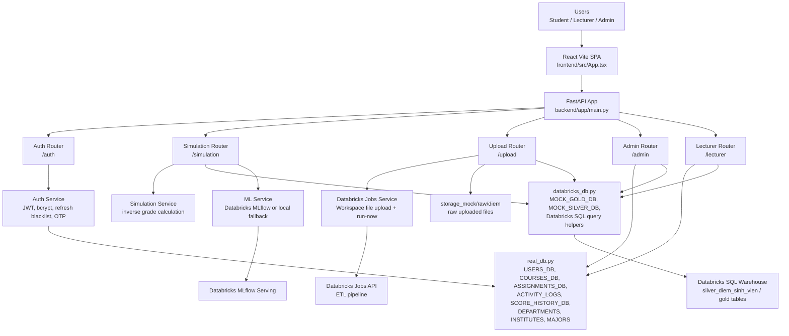
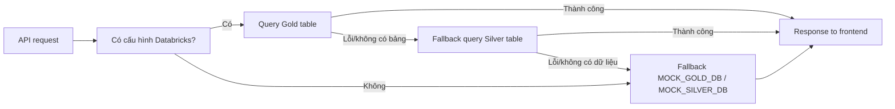
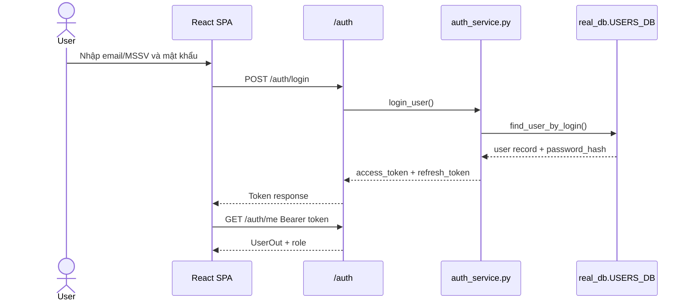
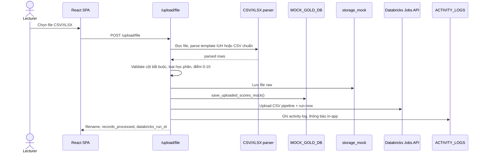
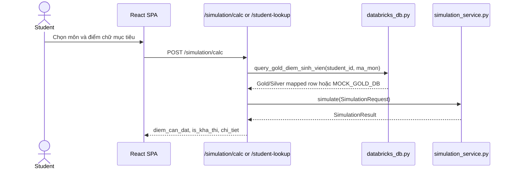
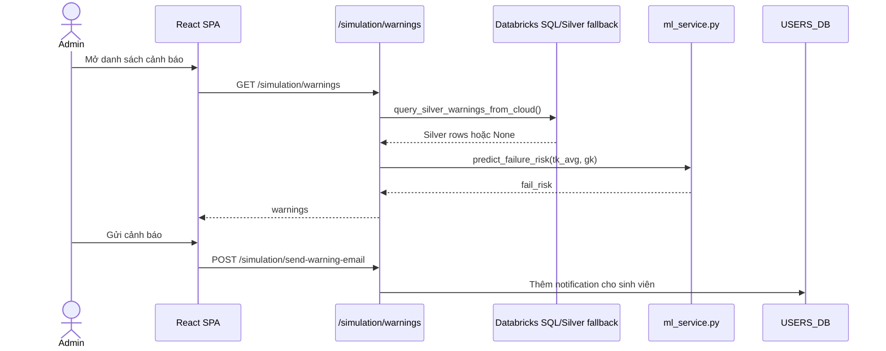
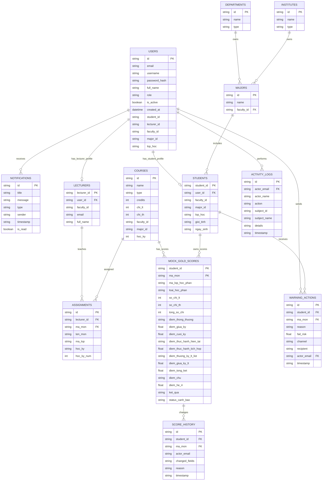
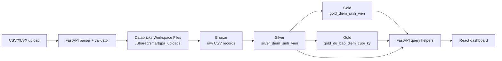

# PROJECT PROPOSAL

# SMARTGPA - Nền Tảng Phân Tích Học Tập Và Giả Lập Điểm

## 1. Thông Tin Chung

### 1.1 Thành Viên Nhóm

| STT | Họ và tên | MSSV | Vai trò |
| --- | --- | --- | --- |
| 1 | Nguyễn Thị Quỳnh Trang | 23676071 | Leader / SOA Backend Architect |
| 2 | Vũ Ngọc Thu Phương | 23696981 | Data Engineer |
| 3 | Phan Trần Thảo Vy | 23670631 | ML / Cloud Engineer |
| 4 | Ngô Phước Thiên | 23670311 | Frontend Developer |
| 5 | Trương Thế Hải Thịnh | 23725051 | QA / Data Analyst |

**Git Repository:** [https://github.com/mangcutxinh/Smart-GPA](https://github.com/mangcutxinh/Smart-GPA)

### 1.2 Phân Chia Tác Vụ Theo Code Hiện Tại

| Nhóm tác vụ | Module/file chính | Người phụ trách | Kết quả hiện tại |
| --- | --- | --- | --- |
| Auth Gateway, JWT, phân quyền | `backend/app/routers/auth.py`, `core/security.py`, `core/dependencies.py`, `services/auth_service.py` | Nguyễn Thị Quỳnh Trang | Đăng nhập, đăng ký, refresh token, logout, `/auth/me`, OTP đổi mật khẩu cho sinh viên. |
| Simulation Engine tính điểm ngược | `backend/app/routers/simulation.py`, `services/simulation_service.py`, `models/schemas.py` | Nguyễn Thị Quỳnh Trang | Tính điểm cần đạt cho môn lý thuyết, thực hành, tích hợp; trả bảng quy đổi điểm; tích hợp tra cứu bảng điểm theo MSSV. |
| Data ingestion và Databricks pipeline | `backend/app/routers/upload.py`, `services/databricks_jobs.py`, `db/databricks_db.py` | Vũ Ngọc Thu Phương | Upload CSV/XLSX, parse mẫu bảng điểm IUH, validate điểm 0-10, lưu mock storage, đồng bộ mock Gold, upload file lên Databricks Workspace và trigger Jobs API. |
| ML risk prediction | `backend/app/services/ml_service.py`, `routers/simulation.py` | Phan Trần Thảo Vy | Gọi Databricks MLflow Serving nếu có cấu hình; fallback local theo điểm thường kỳ/giữa kỳ; cấp API cảnh báo học vụ. |
| Admin management | `backend/app/routers/admin.py`, `db/real_db.py`, `db/databricks_db.py` | Nguyễn Thị Quỳnh Trang, Trương Thế Hải Thịnh | Quản lý học kỳ, môn học, phân công giảng viên, khoa/viện/ngành, sinh viên, giảng viên, điểm, lịch sử điểm, cảnh báo, quy chế chấm điểm. |
| Lecturer portal API | `backend/app/routers/lecturer.py`, `routers/upload.py` | Ngô Phước Thiên, Vũ Ngọc Thu Phương | Giảng viên xem môn được phân công, xem điểm theo môn, sửa/xóa điểm, upload bảng điểm theo môn. |
| Frontend React Vite | `frontend/src/App.tsx`, `frontend/src/App.css`, `frontend/src/index.css` | Ngô Phước Thiên | SPA cho Student/Lecturer/Admin, tích hợp API auth, simulation, upload, admin và lecturer. |
| QA và tích hợp | `backend/tests/*.py`, `backend/pytest.ini` | Trương Thế Hải Thịnh | Test auth, simulation, data integration, unit test và luồng tích hợp backend. |

> Ghi chú: `backend/app/routers/scores.py` đang tồn tại trong repo nhưng chưa được include trong `backend/app/main.py`, vì vậy chưa được xem là API đang chạy trong bản demo hiện tại.

---

## 2. Mô Tả Dự Án

SmartGPA là hệ thống phân tích học tập, quản lý bảng điểm và giả lập điểm mục tiêu cho sinh viên. Hệ thống cho phép sinh viên tra cứu điểm, chọn mục tiêu điểm chữ và nhận điểm cuối kỳ hoặc điểm thành phần cần đạt; giảng viên upload và điều chỉnh bảng điểm; admin quản lý học vụ, môn học, phân công, lịch sử điểm và cảnh báo. Backend ưu tiên kết nối Databricks SQL/Jobs/MLflow khi có cấu hình, đồng thời có cơ chế fallback local bằng in-memory database để demo và kiểm thử ổn định.

Mục tiêu chính:

- Xây dựng ứng dụng web đa vai trò: Student, Lecturer, Admin.
- Cung cấp API Gateway FastAPI gồm các router nghiệp vụ độc lập.
- Chuẩn hóa luồng upload CSV/XLSX bảng điểm, validate dữ liệu và trigger Databricks pipeline.
- Tính điểm ngược theo quy chế cho môn lý thuyết, thực hành và tích hợp.
- Cảnh báo học vụ bằng logic điểm hiện tại kết hợp MLflow Serving hoặc fallback local.
- Lưu trữ/demo dữ liệu trên in-memory store và tích hợp Databricks Delta Lake khi có cấu hình.

---

## 3. Vai Trò Người Dùng

| Vai trò | Tên hệ thống | Quyền chính theo code |
| --- | --- | --- |
| Sinh viên | Student | Đăng nhập bằng MSSV/email, xem điểm cá nhân, chạy giả lập điểm mục tiêu, xem thông báo in-app. |
| Giảng viên | Lecturer | Xem môn được phân công, xem danh sách điểm theo môn, upload CSV/XLSX, sửa/xóa điểm sinh viên trong môn phụ trách. |
| Quản trị viên | Admin | Quản lý tài khoản, học kỳ, môn học, phân công, khoa/viện/ngành, bảng điểm, lịch sử điểm, cảnh báo học vụ và quy chế chấm điểm. |

---

## 4. Kiến Trúc Tổng Thể

Code hiện tại triển khai theo mô hình FastAPI backend tập trung, tách logic theo router/service/database layer. Đây là API Gateway + Logic Core, không phải microservice tách process. Các thành phần được tách module để dễ bảo trì và có thể tách service riêng trong tương lai.

### 4.1 Sơ Đồ Kiến Trúc Dạng Khối

```text
Student / Lecturer / Admin
          |
          v
React Vite SPA (frontend)
          |
          v
FastAPI Backend Gateway
          |
          +-- /auth       -> Auth Service -> USERS_DB, BLACKLIST, OTP store
          +-- /simulation -> Simulation Service -> Databricks SQL Gold/Silver or Mock Gold
          +-- /upload     -> Upload Parser/Validator -> Mock Storage + Databricks Jobs API
          +-- /admin      -> Admin Management -> real_db stores + Mock Gold/Silver
          +-- /lecturer   -> Lecturer APIs -> assignments, courses, score records
          |
          v
Database / Cloud Layer
          |
          +-- real_db.py: users, courses, assignments, org units, logs, history
          +-- databricks_db.py: Mock Gold/Silver + Databricks SQL Warehouse queries
          +-- Databricks Jobs API: upload CSV to Workspace Files, run ETL job
          +-- MLflow Serving: risk prediction endpoint with local fallback
```

### 4.2 Sơ Đồ Kiến Trúc Mermaid


```mermaid
flowchart TD
    U["Users<br/>Student / Lecturer / Admin"]
    FE["React Vite SPA<br/>frontend/src/App.tsx"]
    API["FastAPI App<br/>backend/app/main.py"]

    Auth["Auth Router<br/>/auth"]
    Sim["Simulation Router<br/>/simulation"]
    Upload["Upload Router<br/>/upload"]
    Admin["Admin Router<br/>/admin"]
    Lecturer["Lecturer Router<br/>/lecturer"]

    AuthSvc["Auth Service<br/>JWT, bcrypt, refresh blacklist, OTP"]
    SimSvc["Simulation Service<br/>inverse grade calculation"]
    MLSvc["ML Service<br/>Databricks MLflow or local fallback"]
    JobsSvc["Databricks Jobs Service<br/>Workspace file upload + run-now"]

    RealDB["real_db.py<br/>USERS_DB, COURSES_DB, ASSIGNMENTS_DB,<br/>ACTIVITY_LOGS, SCORE_HISTORY_DB,<br/>DEPARTMENTS, INSTITUTES, MAJORS"]
    DbrDB["databricks_db.py<br/>MOCK_GOLD_DB, MOCK_SILVER_DB,<br/>Databricks SQL query helpers"]
    Storage["storage_mock/raw/diem<br/>raw uploaded files"]
    DbrSQL["Databricks SQL Warehouse<br/>silver_diem_sinh_vien / gold tables"]
    DbrJobs["Databricks Jobs API<br/>ETL pipeline"]
    ML["Databricks MLflow Serving"]

    U --> FE --> API
    API --> Auth --> AuthSvc --> RealDB
    API --> Sim --> SimSvc
    Sim --> DbrDB
    Sim --> MLSvc
    API --> Upload --> JobsSvc
    Upload --> Storage
    Upload --> DbrDB
    API --> Admin --> RealDB
    Admin --> DbrDB
    API --> Lecturer --> RealDB
    Lecturer --> DbrDB

    DbrDB --> DbrSQL
    JobsSvc --> DbrJobs
    MLSvc --> ML
```

### 4.3 Luồng Fallback Dữ Liệu


```mermaid
flowchart LR
    API["API request"]
    Check["Có cấu hình Databricks?"]
    Gold["Query Gold table"]
    Silver["Fallback query Silver table"]
    Mock["Fallback MOCK_GOLD_DB / MOCK_SILVER_DB"]
    Result["Response to frontend"]

    API --> Check
    Check -- "Có" --> Gold
    Gold -- "Thành công" --> Result
    Gold -- "Lỗi/không có bảng" --> Silver
    Silver -- "Thành công" --> Result
    Silver -- "Lỗi/không có dữ liệu" --> Mock
    Check -- "Không" --> Mock
    Mock --> Result
```

---

## 5. Thành Phần Hệ Thống

### 5.1 Frontend

Frontend là React Vite SPA, hiện thực các portal cho sinh viên, giảng viên và admin. Ứng dụng gọi API FastAPI để đăng nhập, tra cứu điểm, chạy simulation, upload file, quản lý môn học, quản lý cảnh báo và hiển thị thông báo.

### 5.2 FastAPI Gateway

Backend mount các router sau trong `backend/app/main.py`:

| Router | Prefix | Vai trò |
| --- | --- | --- |
| `auth.router` | `/auth` | Xác thực, JWT, refresh, logout, OTP, thông tin user hiện tại. |
| `simulation.router` | `/simulation` | Tính điểm ngược, bảng quy đổi điểm, tra cứu điểm sinh viên, danh sách cảnh báo, ML prediction, thông báo sinh viên. |
| `upload.router` | `/upload` | Upload CSV/XLSX, validate, lưu file raw, đồng bộ mock DB, trigger Databricks pipeline, lịch sử upload/edit. |
| `admin.router` | `/admin` | Quản lý toàn bộ cấu hình học vụ, user, môn, phân công, điểm, lịch sử điểm, cảnh báo, grading rules. |
| `lecturer.router` | `/lecturer` | API riêng cho giảng viên: môn phụ trách, điểm theo môn, sửa/xóa điểm, upload điểm theo môn. |

### 5.3 Database Và Cloud Layer

- `real_db.py`: in-memory store chính cho user, môn học, phân công, khoa/viện/ngành, học kỳ, activity logs, timeline, lịch sử điểm, lịch sử gửi cảnh báo và grading rules.
- `fake_db.py`: compatibility wrapper, re-export từ `real_db.py` để các import cũ không bị lỗi.
- `databricks_db.py`: chứa `MOCK_GOLD_DB`, `MOCK_SILVER_DB`, các hàm query Databricks SQL và fallback local.
- `services/databricks_jobs.py`: upload CSV lên Workspace Files, trigger Databricks Job bằng `/api/2.2/jobs/run-now`, kiểm tra run status.
- `services/ml_service.py`: gọi Databricks MLflow Serving nếu có host/token; nếu không thì dùng local fallback risk model.

---

## 6. Luồng Xử Lý Nghiệp Vụ

### 6.1 Luồng Đăng Nhập Và Phân Quyền


```mermaid
sequenceDiagram
    actor User
    participant FE as React SPA
    participant Auth as /auth
    participant AuthSvc as auth_service.py
    participant DB as real_db.USERS_DB

    User->>FE: Nhập email/MSSV và mật khẩu
    FE->>Auth: POST /auth/login
    Auth->>AuthSvc: login_user()
    AuthSvc->>DB: find_user_by_login()
    DB-->>AuthSvc: user record + password_hash
    AuthSvc-->>Auth: access_token + refresh_token
    Auth-->>FE: Token response
    FE->>Auth: GET /auth/me Bearer token
    Auth-->>FE: UserOut + role
```

### 6.2 Luồng Upload Bảng Điểm


```mermaid
sequenceDiagram
    actor Lecturer
    participant FE as React SPA
    participant Upload as /upload/file
    participant Parser as CSV/XLSX parser
    participant Mock as MOCK_GOLD_DB
    participant Storage as storage_mock
    participant Jobs as Databricks Jobs API
    participant Logs as ACTIVITY_LOGS

    Lecturer->>FE: Chọn file CSV/XLSX
    FE->>Upload: POST /upload/file
    Upload->>Parser: Đọc file, parse template IUH hoặc CSV chuẩn
    Parser-->>Upload: parsed rows
    Upload->>Upload: Validate cột bắt buộc, loại học phần, điểm 0-10
    Upload->>Storage: Lưu file raw
    Upload->>Mock: save_uploaded_scores_mock()
    Upload->>Jobs: Upload CSV pipeline + run-now
    Upload->>Logs: Ghi activity log, thông báo in-app
    Upload-->>FE: filename, records_processed, databricks_run_id
```

### 6.3 Luồng Sinh Viên Giả Lập Điểm Mục Tiêu


```mermaid
sequenceDiagram
    actor Student
    participant FE as React SPA
    participant Sim as /simulation/calc or /student-lookup
    participant DDB as databricks_db.py
    participant Svc as simulation_service.py

    Student->>FE: Chọn môn và điểm chữ mục tiêu
    FE->>Sim: POST /simulation/calc
    Sim->>DDB: query_gold_diem_sinh_vien(student_id, ma_mon)
    DDB-->>Sim: Gold/Silver mapped row hoặc MOCK_GOLD_DB
    Sim->>Svc: simulate(SimulationRequest)
    Svc-->>Sim: SimulationResult
    Sim-->>FE: diem_can_dat, is_kha_thi, chi_tiet
```

### 6.4 Luồng Cảnh Báo Học Vụ Và ML


```mermaid
sequenceDiagram
    actor Admin
    participant FE as React SPA
    participant Sim as /simulation/warnings
    participant DDB as Databricks SQL/Silver fallback
    participant ML as ml_service.py
    participant UserDB as USERS_DB

    Admin->>FE: Mở danh sách cảnh báo
    FE->>Sim: GET /simulation/warnings
    Sim->>DDB: query_silver_warnings_from_cloud()
    DDB-->>Sim: Silver rows hoặc None
    Sim->>ML: predict_failure_risk(tk_avg, gk)
    ML-->>Sim: fail_risk
    Sim-->>FE: warnings
    Admin->>FE: Gửi cảnh báo
    FE->>Sim: POST /simulation/send-warning-email
    Sim->>UserDB: Thêm notification cho sinh viên
```

---

## 7. Quy Chế Tính Điểm

### 7.1 Môn Lý Thuyết

```text
T = 0.2 * ĐTB_TK + 0.3 * GK + 0.5 * CK
CK_cần_đạt = (Điểm_mục_tiêu - 0.2 * ĐTB_TK - 0.3 * GK) / 0.5
```

Điều kiện code đang validate:

- `diem_giua_ky` bắt buộc.
- Có `diem_thuong_ky_list` kèm `so_tin_chi` bằng 2 hoặc 3, hoặc có `diem_thuong_ky` legacy.
- Điểm cần đạt được làm tròn lên 1 chữ số thập phân.
- Nếu điểm cần đạt > 10 thì `is_kha_thi = false`.

### 7.2 Môn Thực Hành

```text
T = mean(TH_1, ..., TH_n)
Điểm_cần_đạt_cho_mỗi_buổi_còn_lại =
    (Điểm_mục_tiêu * tổng_số_buổi - sum(TH_đã_có)) / số_buổi_còn_lại
```

Điều kiện code đang validate:

- Cần `diem_thuc_hanh_hien_tai` và `so_tin_chi` hoặc `tong_so_buoi`.
- Nếu đã đủ buổi, trả kết quả dựa trên điểm trung bình hiện tại.
- Nếu điểm trung bình thực hành < 3.0 thì trả cảnh báo liệt thực hành/rớt môn.

### 7.3 Môn Tích Hợp

```text
T = (T_LT * so_chi_lt + T_TH * so_chi_th) / (so_chi_lt + so_chi_th)
T_LT_cần_đạt = (Điểm_mục_tiêu * tổng_chỉ - T_TH * so_chi_th) / so_chi_lt
```

Nếu có đầy đủ điểm lý thuyết thành phần:

```text
T_LT = 0.2 * ĐTB_TK_LT + 0.3 * GK_LT + 0.5 * CK_LT
CK_LT_cần_đạt = (T_LT_cần_đạt - 0.2 * ĐTB_TK_LT - 0.3 * GK_LT) / 0.5
```

Điều kiện code đang validate:

- Bắt buộc có `so_chi_lt`, `so_chi_th`, `diem_thuc_hanh_tich_hop`.
- Nếu `diem_thuc_hanh_tich_hop < 3.0` thì bất khả thi do liệt thực hành.
- Nếu có `diem_thuong_ky_lt_list`, số đầu điểm phải bằng `so_chi_lt`.

### 7.4 Bảng Quy Đổi Điểm

| Điểm chữ | Điểm 10 min | Điểm 10 max | Điểm hệ 4 | Kết quả |
| --- | ---: | ---: | ---: | --- |
| A+ | 9.0 | 10.0 | 4.0 | Đạt |
| A | 8.5 | 8.9 | 4.0 | Đạt |
| B+ | 8.0 | 8.4 | 3.5 | Đạt |
| B | 7.0 | 7.9 | 3.0 | Đạt |
| C+ | 6.0 | 6.9 | 2.5 | Đạt |
| C | 5.5 | 5.9 | 2.0 | Đạt |
| D+ | 5.0 | 5.4 | 1.5 | Đạt |
| D | 4.0 | 4.9 | 1.0 | Đạt |
| F | 0.0 | 3.9 | 0.0 | Không đạt |

---

## 8. Thiết Kế Cơ Sở Dữ Liệu

Hệ thống hiện dùng in-memory stores để demo/test, được seed khi import `real_db.py`. Khi có Databricks config, các API đọc điểm ưu tiên query Databricks SQL Warehouse, sau đó fallback về mock store.

### 8.1 Bảng/Store Nghiệp Vụ Trong Backend

| Store | File | Mục đích | Trường chính |
| --- | --- | --- | --- |
| `USERS_DB` | `real_db.py` | Tài khoản admin, lecturer, student | `id`, `email`, `username`, `password_hash`, `full_name`, `role`, `student_id`, `lecturer_id`, `faculty_id`, `major_id`, `lop_hoc`, `notifications` |
| `BLACKLIST` | `real_db.py` | Refresh token đã logout | token string |
| `PASSWORD_RESET_OTPS` | `real_db.py` | OTP đổi mật khẩu | `username`, `email`, `otp`, expiry metadata |
| `COURSES_DB` | `real_db.py` | Danh mục môn học | `id`, `name`, `type`, `credits`, `chi_lt`, `chi_th`, `faculty_id`, `major_id`, `hoc_ky` |
| `ASSIGNMENTS_DB` | `real_db.py` | Phân công giảng viên | `id`, `lecturer_id`, `ma_mon`, `ten_mon`, `ma_lop`, `hoc_ky`, `hoc_ky_num` |
| `DEPARTMENTS_DB` | `real_db.py` | Danh mục khoa | `id`, `name`, `type` |
| `INSTITUTES_DB` | `real_db.py` | Danh mục viện | `id`, `name`, `type` |
| `MAJORS_DB` | `real_db.py` | Danh mục ngành/chuyên ngành | `id`, `name`, `faculty_id` |
| `ACTIVITY_LOGS` | `real_db.py` | Nhật ký upload, sửa điểm, admin actions | `id`, `actor_email`, `actor_name`, `action`, `subject_id`, `subject_name`, `details`, `timestamp` |
| `TIMELINE_UPDATES` | `real_db.py` | Timeline cập nhật dự án/hệ thống | `id`, `title`, `category`, `details`, `actor_email`, `timestamp` |
| `SCORE_HISTORY_DB` | `real_db.py` | Lịch sử thay đổi điểm | `id/event_id`, `student_id`, `ma_mon`, `old_record`, `new_record`, `changed_fields`, `actor`, `timestamp` |
| `WARNING_ACTIONS` | `real_db.py` | Lịch sử gửi cảnh báo | `id`, `student_id`, `ma_mon`, `reason`, `fail_risk`, `channel`, `recipient`, `actor_email`, `timestamp` |
| `GRADING_RULES_DB` | `real_db.py` | Cấu hình quy chế chấm điểm | `version`, `theory_weights`, `practice_min_pass`, `integrated_default_credits`, `updated_at` |
| `MOCK_GOLD_DB` | `databricks_db.py` | Bảng điểm hiện tại theo `(student_id, ma_mon)` | điểm thành phần, loại học phần, tín chỉ, tổng kết, điểm chữ, cảnh báo |
| `MOCK_SILVER_DB` | `databricks_db.py` | View cảnh báo local suy ra từ Gold | `avg_tk`, `gk`, `risk_flag`, `status_canh_bao` |

### 8.2 Bảng Databricks Được Code Truy Vấn

| Bảng | Mục đích | Nội dung code đang dùng |
| --- | --- | --- |
| `workspace.smartgpa_db.gold_diem_sinh_vien` | Điểm tổng hợp theo sinh viên-môn | `student_id`, `ma_mon`, `diem_thong_thuong`, `diem_giua_ky`, `diem_cuoi_ky`, `loai_hoc_phan`, `so_chi_lt`, `so_chi_th`, `tong_so_chi`, `status_canh_bao` |
| `workspace.smartgpa_db.silver_diem_sinh_vien` | Điểm đã chuẩn hóa sau ETL | `student_id`, `student_name`, `ma_mon`, `ten_mon`, `ma_lop_hoc_phan`, `loai_hoc_phan`, `so_chi_lt`, `so_chi_th`, `tong_so_chi`, `thuong_xuyen_1`, `thuong_xuyen_2`, `giua_ky`, `thuc_hanh_1..3`, `qt_10`, `diem_cuoi_ky` |
| `workspace.smartgpa_db.gold_du_bao_diem_cuoi_ky` | Dự báo điểm cần đạt theo mục tiêu | `student_id`, `ma_mon`, `qt_10`, `diem_chu_muc_tieu`, `diem_muc_tieu_10`, `diem_cuoi_ky_can_dat`, `kha_thi`, `status_canh_bao` |

Tên catalog/schema/table có thể cấu hình bằng biến môi trường `DATABRICKS_CATALOG`, `DATABRICKS_SCHEMA`, `DATABRICKS_GOLD_TABLE`.

### 8.3 Sơ Đồ ERD Backend Hiện Tại


```mermaid
erDiagram
    USERS ||--o{ NOTIFICATIONS : receives
    USERS ||--o| STUDENTS : has_student_profile
    USERS ||--o| LECTURERS : has_lecturer_profile
    LECTURERS ||--o{ ASSIGNMENTS : teaches
    COURSES ||--o{ ASSIGNMENTS : assigned
    DEPARTMENTS ||--o{ MAJORS : owns
    INSTITUTES ||--o{ MAJORS : owns
    MAJORS ||--o{ STUDENTS : includes
    COURSES ||--o{ MOCK_GOLD_SCORES : has_scores
    STUDENTS ||--o{ MOCK_GOLD_SCORES : owns_scores
    MOCK_GOLD_SCORES ||--o{ SCORE_HISTORY : changes
    USERS ||--o{ ACTIVITY_LOGS : performs
    USERS ||--o{ WARNING_ACTIONS : sends
    STUDENTS ||--o{ WARNING_ACTIONS : receives

    USERS {
        string id PK
        string email
        string username
        string password_hash
        string full_name
        string role
        boolean is_active
        datetime created_at
        string student_id
        string lecturer_id
        string faculty_id
        string major_id
        string lop_hoc
    }

    STUDENTS {
        string student_id PK
        string user_id FK
        string faculty_id
        string major_id
        string lop_hoc
        string gioi_tinh
        string ngay_sinh
    }

    LECTURERS {
        string lecturer_id PK
        string user_id FK
        string faculty_id
        string email
        string full_name
    }

    COURSES {
        string id PK
        string name
        string type
        int credits
        int chi_lt
        int chi_th
        string faculty_id
        string major_id
        int hoc_ky
    }

    ASSIGNMENTS {
        string id PK
        string lecturer_id FK
        string ma_mon FK
        string ten_mon
        string ma_lop
        string hoc_ky
        int hoc_ky_num
    }

    DEPARTMENTS {
        string id PK
        string name
        string type
    }

    INSTITUTES {
        string id PK
        string name
        string type
    }

    MAJORS {
        string id PK
        string name
        string faculty_id FK
    }

    MOCK_GOLD_SCORES {
        string student_id PK
        string ma_mon PK
        string ma_lop_hoc_phan
        string loai_hoc_phan
        int so_chi_lt
        int so_chi_th
        int tong_so_chi
        string diem_thong_thuong
        float diem_giua_ky
        float diem_cuoi_ky
        string diem_thuc_hanh_hien_tai
        float diem_thuc_hanh_tich_hop
        string diem_thuong_ky_lt_list
        float diem_giua_ky_lt
        float diem_tong_ket
        string diem_chu
        float diem_he_4
        string ket_qua
        string status_canh_bao
    }

    SCORE_HISTORY {
        string id PK
        string student_id FK
        string ma_mon FK
        string actor_email
        string changed_fields
        string reason
        string timestamp
    }

    ACTIVITY_LOGS {
        string id PK
        string actor_email FK
        string actor_name
        string action
        string subject_id
        string subject_name
        string details
        string timestamp
    }

    WARNING_ACTIONS {
        string id PK
        string student_id FK
        string ma_mon FK
        string reason
        float fail_risk
        string channel
        string recipient
        string actor_email FK
        string timestamp
    }

    NOTIFICATIONS {
        string id PK
        string title
        string message
        string type
        string sender
        string timestamp
        boolean is_read
    }
```

### 8.4 Sơ Đồ Medallion/Databricks


```mermaid
flowchart LR
    Upload["CSV/XLSX upload"]
    Parser["FastAPI parser + validator"]
    Workspace["Databricks Workspace Files<br/>/Shared/smartgpa_uploads"]
    Bronze["Bronze<br/>raw CSV records"]
    Silver["Silver<br/>silver_diem_sinh_vien"]
    GoldScores["Gold<br/>gold_diem_sinh_vien"]
    GoldPred["Gold<br/>gold_du_bao_diem_cuoi_ky"]
    API["FastAPI query helpers"]
    FE["React dashboard"]

    Upload --> Parser
    Parser --> Workspace
    Workspace --> Bronze
    Bronze --> Silver
    Silver --> GoldScores
    Silver --> GoldPred
    GoldScores --> API
    GoldPred --> API
    Silver --> API
    API --> FE
```

---

## 9. API Chính

| Method | Endpoint | Role | Chức năng |
| --- | --- | --- | --- |
| `POST` | `/auth/register` | Public | Tạo tài khoản student/lecturer/admin. |
| `POST` | `/auth/login` | Public | Đăng nhập, trả access token và refresh token. |
| `POST` | `/auth/refresh` | Public | Làm mới access token. |
| `POST` | `/auth/logout` | Authenticated | Blacklist refresh token. |
| `GET` | `/auth/me` | Authenticated | Lấy thông tin user hiện tại. |
| `POST` | `/simulation/simulate` | Student | Tính điểm ngược từ payload điểm thành phần. |
| `GET` | `/simulation/score-map` | Authenticated | Lấy bảng quy đổi điểm. |
| `POST` | `/simulation/calc` | Authenticated | Lấy điểm từ Databricks/mock và tính điểm mục tiêu. |
| `GET` | `/simulation/student-lookup/{student_id}` | Authenticated | Tra cứu tất cả môn của sinh viên, student chỉ xem được chính mình. |
| `GET` | `/simulation/warnings` | Admin | Lấy danh sách cảnh báo học vụ. |
| `POST` | `/simulation/predict-risk` | Admin | Dự đoán tỷ lệ rớt môn. |
| `POST` | `/simulation/send-warning-email` | Admin | Giả lập gửi email và thêm notification cảnh báo. |
| `GET` | `/simulation/student-notifications` | Student | Lấy thông báo in-app. |
| `POST` | `/upload/file` | Lecturer/Admin | Upload CSV/XLSX và trigger Databricks pipeline. |
| `GET` | `/upload/status/{run_id}` | Lecturer/Admin | Kiểm tra trạng thái Databricks run. |
| `GET` | `/upload/activities` | Admin | Xem activity logs. |
| `POST` | `/upload/edit` | Lecturer/Admin | Sửa điểm trực tiếp trong mock Gold. |
| `GET/POST/PUT/DELETE` | `/admin/*` | Admin | Quản lý học vụ, user, môn, phân công, điểm, cảnh báo, rules. |
| `GET/PUT/DELETE/POST` | `/lecturer/*` | Lecturer | API dành cho giảng viên. |

---

## 10. Yêu Cầu Chức Năng

### 10.1 Must Have Đã Phù Hợp Code

- Đăng nhập bằng email/MSSV và mật khẩu, sinh JWT access/refresh token.
- Phân quyền theo role Student/Lecturer/Admin bằng dependency FastAPI.
- Sinh viên chạy simulation điểm mục tiêu cho môn lý thuyết, thực hành, tích hợp.
- Sinh viên tra cứu bảng điểm theo MSSV, có rule chỉ xem bảng điểm của chính mình.
- Giảng viên/Admin upload CSV/XLSX, validate header và điểm 0-10.
- Upload thành công thì đồng bộ vào `MOCK_GOLD_DB`, lưu raw file, ghi activity log, trigger Databricks Job.
- Admin quản lý học kỳ, môn học, phân công, user, khoa/viện/ngành, điểm và lịch sử điểm.
- Admin xem/gửi cảnh báo học vụ; sinh viên nhận notification in-app.

### 10.2 Should Have

- Databricks SQL Warehouse có bảng Silver/Gold đúng schema code đang query.
- Databricks MLflow Serving endpoint cho dự đoán risk thật, thay cho fallback local.
- Dashboard frontend lọc theo lớp, môn, học kỳ, giảng viên.
- Đồng bộ hai chiều giữa sửa điểm local/mock và Delta table thật nếu triển khai production.

### 10.3 Could Have

- Include và hoàn thiện `backend/app/routers/scores.py` vào `main.py` nếu muốn có REST scores API `/api/v1/scores`.
- Chuyển in-memory stores sang database bền vững như PostgreSQL.
- Tách Auth, Simulation, Upload, Admin thành các service riêng nếu cần scale độc lập.
- Thêm notification/email provider thật thay cho console simulation.

---

## 11. Yêu Cầu Phi Chức Năng

| Nhóm yêu cầu | Mô tả theo code hiện tại |
| --- | --- |
| Bảo mật | JWT HS256, bcrypt password, role guard, blacklist refresh token sau logout. |
| Toàn vẹn dữ liệu | Validate file upload, validate điểm 0-10, ghi activity log và score history khi sửa điểm. |
| Khả dụng demo | Có fallback local nếu Databricks SQL/Jobs/MLflow chưa cấu hình hoặc lỗi kết nối. |
| Hiệu năng | Simulation tính trực tiếp trong FastAPI, phù hợp request real-time. |
| Khả bảo trì | Tách layer Router -> Service -> DB helper, Pydantic schema tập trung trong `models/schemas.py`. |
| Khả quan sát | Lưu `databricks_run_id`, activity logs, timeline updates, score history, warning actions. |

---

## 12. Kế Hoạch Kiểm Thử

| Mã TC | Module | Kịch bản | Kết quả mong đợi |
| --- | --- | --- | --- |
| TC-01 | Auth | Login đúng email/MSSV và password | Trả access token, refresh token, role đúng. |
| TC-02 | Auth | Gọi protected endpoint không token | Trả `401 Unauthorized`. |
| TC-03 | Role guard | Student gọi upload/admin API | Trả `403 Forbidden`. |
| TC-04 | Simulation | Môn lý thuyết có TK/GK, mục tiêu A | Trả `diem_can_dat` theo công thức. |
| TC-05 | Simulation | Điểm cần đạt > 10 | Trả `is_kha_thi = false`. |
| TC-06 | Simulation | Môn thực hành điểm TH < 3 | Trả cảnh báo liệt thực hành/rớt môn. |
| TC-07 | Simulation | Môn tích hợp thiếu điểm thành phần | Trả lỗi/kết quả bất khả thi phù hợp validation. |
| TC-08 | Upload | File sai định dạng | Trả `422 Unprocessable Entity`. |
| TC-09 | Upload | CSV/XLSX thiếu cột bắt buộc | Trả danh sách cột thiếu. |
| TC-10 | Upload | File hợp lệ | Lưu raw file, sync mock DB, trigger Databricks Job, trả `databricks_run_id`. |
| TC-11 | Admin | Sửa điểm | Cập nhật `MOCK_GOLD_DB`, sync silver, ghi score history và activity log. |
| TC-12 | Warnings | Admin lấy danh sách cảnh báo | Trả risk list từ Databricks Silver hoặc fallback mock + ML local. |
| TC-13 | Lecturer | Giảng viên xem môn phụ trách | Trả danh sách assignments và điểm theo môn. |

---

## 13. Kết Quả Demo Hiện Tại

- Backend FastAPI chạy tại `http://localhost:8001`, docs tại `/docs`.
- Frontend Vite chạy tại `http://localhost:5173`.
- Dữ liệu demo được seed trong `real_db.py`: admin, giảng viên, 98 sinh viên DHKHDL19A/B, danh mục môn học 9 học kỳ, phân công giảng viên.
- `MOCK_GOLD_DB` lưu điểm theo khóa `(student_id, ma_mon)` cho các môn đã/đang học.
- Upload CSV/XLSX có hỗ trợ parse mẫu bảng điểm IUH, map mã môn thật sang mã môn nội bộ qua `COURSE_ID_MAP`.
- Có tích hợp Databricks SQL/Jobs/MLflow qua biến môi trường, và có fallback local để test/demo.

---


