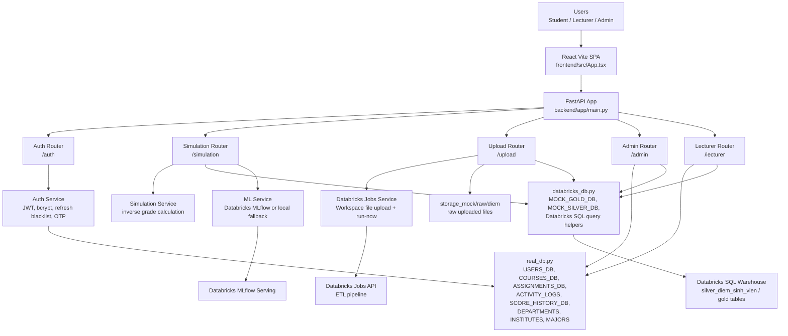
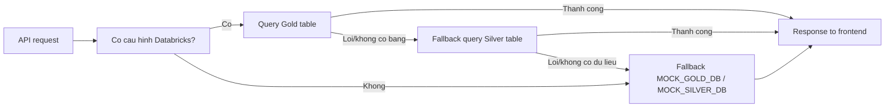
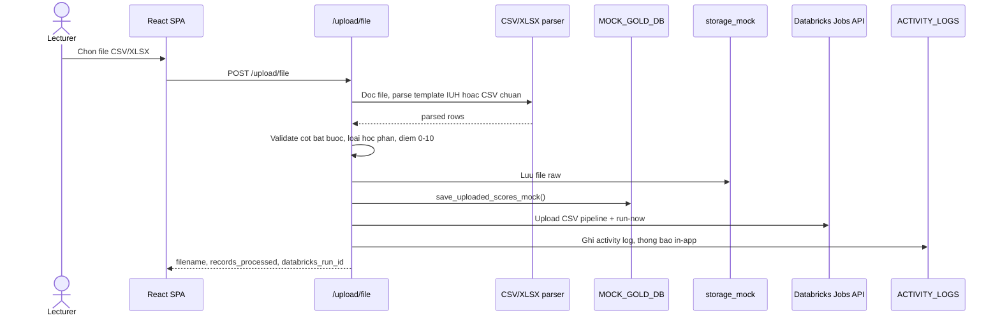
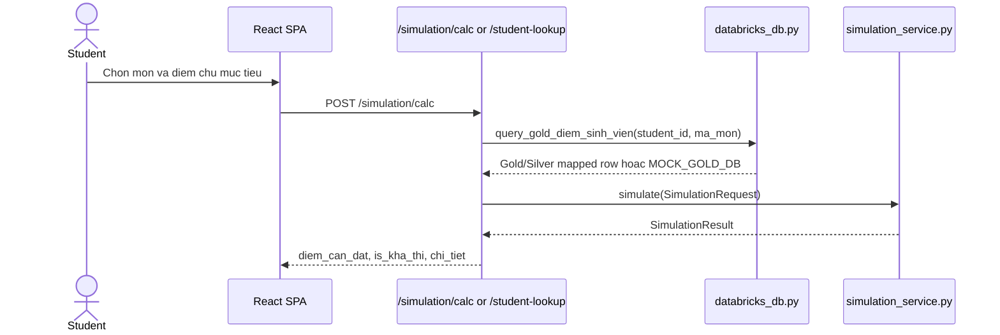
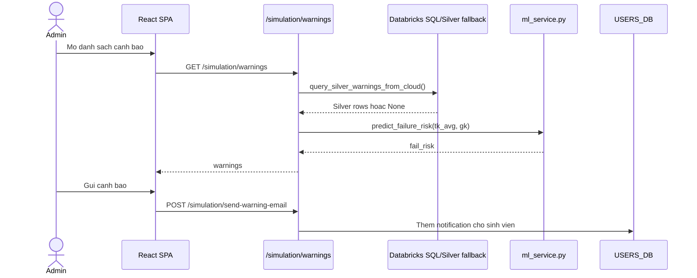
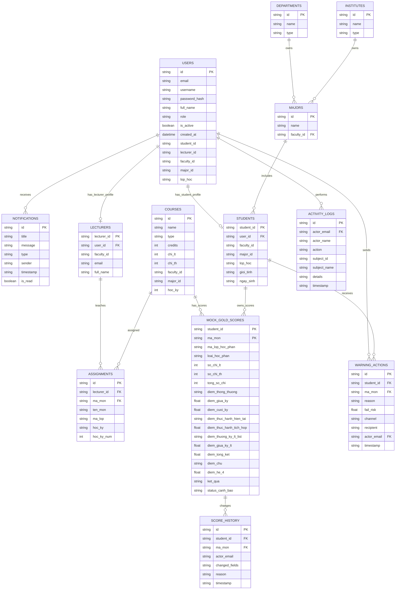
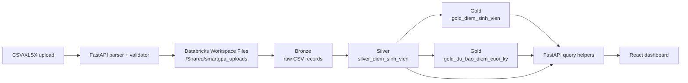

# PROJECT PROPOSAL

# SMARTGPA - Academic Analytics & Grade Simulation Platform

## 1. Thong Tin Chung

### 1.1 Thanh vien nhom

| STT | Ho va ten | MSSV | Vai tro |
| --- | --- | --- | --- |
| 1 | Nguyen Thi Quynh Trang | 23676071 | Leader / SOA Backend Architect |
| 2 | Vu Ngoc Thu Phuong | 23696981 | Data Engineer |
| 3 | Phan Tran Thao Vy | 23670631 | ML / Cloud Engineer |
| 4 | Ngo Phuoc Thien | 23670311 | Frontend Developer |
| 5 | Truong The Hai Thinh | 23725051 | QA / Data Analyst |

**Git Repository:** [https://github.com/mangcutxinh/Smart-GPA](https://github.com/mangcutxinh/Smart-GPA)

### 1.2 Phan chia tac vu theo code hien tai

| Nhom tac vu | Module/file chinh | Nguoi phu trach | Ket qua hien tai |
| --- | --- | --- | --- |
| Auth Gateway, JWT, role guard | `backend/app/routers/auth.py`, `core/security.py`, `core/dependencies.py`, `services/auth_service.py` | Nguyen Thi Quynh Trang | Dang nhap, dang ky, refresh token, logout, `/auth/me`, OTP doi mat khau cho sinh vien. |
| Simulation Engine tinh diem nguoc | `backend/app/routers/simulation.py`, `services/simulation_service.py`, `models/schemas.py` | Nguyen Thi Quynh Trang | Tinh diem can dat cho mon ly thuyet, thuc hanh, tich hop; tra bang quy doi diem; tich hop truy van bang diem theo MSSV. |
| Data ingestion va Databricks pipeline | `backend/app/routers/upload.py`, `services/databricks_jobs.py`, `db/databricks_db.py` | Vu Ngoc Thu Phuong | Upload CSV/XLSX, parse mau bang diem IUH, validate diem 0-10, luu mock storage, dong bo mock Gold, upload file len Databricks Workspace va trigger Jobs API. |
| ML risk prediction | `backend/app/services/ml_service.py`, `routers/simulation.py` | Phan Tran Thao Vy | Goi Databricks MLflow Serving neu co cau hinh; fallback local theo diem thuong ky/giua ky; cap API canh bao hoc vu. |
| Admin management | `backend/app/routers/admin.py`, `db/real_db.py`, `db/databricks_db.py` | Nguyen Thi Quynh Trang, Truong The Hai Thinh | Quan ly hoc ky, mon hoc, phan cong giang vien, khoa/vien/nganh, sinh vien, giang vien, diem, lich su diem, canh bao, quy che cham diem. |
| Lecturer portal API | `backend/app/routers/lecturer.py`, `routers/upload.py` | Ngo Phuoc Thien, Vu Ngoc Thu Phuong | Giang vien xem mon duoc phan cong, xem diem theo mon, sua/xoa diem, upload bang diem theo mon. |
| Frontend React Vite | `frontend/src/App.tsx`, `frontend/src/App.css`, `frontend/src/index.css` | Ngo Phuoc Thien | SPA cho Student/Lecturer/Admin, tich hop API auth, simulation, upload, admin va lecturer. |
| QA va tich hop | `backend/tests/*.py`, `backend/pytest.ini` | Truong The Hai Thinh | Test auth, simulation, data integration, unit test va luong tich hop backend. |

> Ghi chu: `backend/app/routers/scores.py` dang ton tai trong repo nhung chua duoc include trong `backend/app/main.py`, vi vay khong duoc xem la API dang chay trong ban demo hien tai.

---

## 2. Mo Ta Du An

SmartGPA la he thong phan tich hoc tap, quan ly bang diem va gia lap diem muc tieu cho sinh vien. He thong cho phep sinh vien tra cuu diem, chon muc tieu diem chu va nhan diem cuoi ky/diem thanh phan can dat; giang vien upload va dieu chinh bang diem; admin quan ly hoc vu, mon hoc, phan cong, lich su diem va canh bao. Backend uu tien ket noi Databricks SQL/Jobs/MLflow khi co cau hinh, dong thoi co co che fallback local bang in-memory database de demo va test on dinh.

Muc tieu chinh:

- Xay dung ung dung web da vai tro: Student, Lecturer, Admin.
- Cung cap API Gateway FastAPI gom cac router nghiep vu doc lap.
- Chuan hoa luong upload CSV/XLSX bang diem, validate du lieu va trigger Databricks pipeline.
- Tinh diem nguoc theo quy che cho mon ly thuyet, thuc hanh va tich hop.
- Canh bao hoc vu bang logic diem hien tai ket hop MLflow Serving hoac fallback local.
- Luu tru/demo du lieu tren in-memory store va tich hop Databricks Delta Lake khi co cau hinh.

---

## 3. Vai Tro Nguoi Dung

| Vai tro | Ten he thong | Quyen chinh theo code |
| --- | --- | --- |
| Sinh vien | Student | Dang nhap bang MSSV/email, xem diem ca nhan, chay gia lap diem muc tieu, xem thong bao in-app. |
| Giang vien | Lecturer | Xem mon duoc phan cong, xem danh sach diem theo mon, upload CSV/XLSX, sua/xoa diem sinh vien trong mon phu trach. |
| Quan tri vien | Admin | Quan ly tai khoan, hoc ky, mon hoc, phan cong, khoa/vien/nganh, bang diem, lich su diem, canh bao hoc vu va quy che cham diem. |

---

## 4. Kien Truc Tong The

Code hien tai trien khai theo mo hinh FastAPI backend tap trung, tach logic theo router/service/database layer. Day la API Gateway + Logic Core, khong phai microservice tach process. Cac thanh phan duoc tach module de bao tri va co the tach service rieng trong tuong lai.

### 4.1 So do kien truc dang khoi

```text
Student / Lecturer / Admin
          |
          v
React Vite SPA (frontend)
          |
          v
FastAPI Backend Gateway
          |
          +-- /auth       -> Auth Service -> USERS_DB, BLACKLIST, OTP store
          +-- /simulation -> Simulation Service -> Databricks SQL Gold/Silver or Mock Gold
          +-- /upload     -> Upload Parser/Validator -> Mock Storage + Databricks Jobs API
          +-- /admin      -> Admin Management -> real_db stores + Mock Gold/Silver
          +-- /lecturer   -> Lecturer APIs -> assignments, courses, score records
          |
          v
Database / Cloud Layer
          |
          +-- real_db.py: users, courses, assignments, org units, logs, history
          +-- databricks_db.py: Mock Gold/Silver + Databricks SQL Warehouse queries
          +-- Databricks Jobs API: upload CSV to Workspace Files, run ETL job
          +-- MLflow Serving: risk prediction endpoint with local fallback
```

### 4.2 So do kien truc Mermaid


```mermaid
flowchart TD
    U["Users<br/>Student / Lecturer / Admin"]
    FE["React Vite SPA<br/>frontend/src/App.tsx"]
    API["FastAPI App<br/>backend/app/main.py"]

    Auth["Auth Router<br/>/auth"]
    Sim["Simulation Router<br/>/simulation"]
    Upload["Upload Router<br/>/upload"]
    Admin["Admin Router<br/>/admin"]
    Lecturer["Lecturer Router<br/>/lecturer"]

    AuthSvc["Auth Service<br/>JWT, bcrypt, refresh blacklist, OTP"]
    SimSvc["Simulation Service<br/>inverse grade calculation"]
    MLSvc["ML Service<br/>Databricks MLflow or local fallback"]
    JobsSvc["Databricks Jobs Service<br/>Workspace file upload + run-now"]

    RealDB["real_db.py<br/>USERS_DB, COURSES_DB, ASSIGNMENTS_DB,<br/>ACTIVITY_LOGS, SCORE_HISTORY_DB,<br/>DEPARTMENTS, INSTITUTES, MAJORS"]
    DbrDB["databricks_db.py<br/>MOCK_GOLD_DB, MOCK_SILVER_DB,<br/>Databricks SQL query helpers"]
    Storage["storage_mock/raw/diem<br/>raw uploaded files"]
    DbrSQL["Databricks SQL Warehouse<br/>silver_diem_sinh_vien / gold tables"]
    DbrJobs["Databricks Jobs API<br/>ETL pipeline"]
    ML["Databricks MLflow Serving"]

    U --> FE --> API
    API --> Auth --> AuthSvc --> RealDB
    API --> Sim --> SimSvc
    Sim --> DbrDB
    Sim --> MLSvc
    API --> Upload --> JobsSvc
    Upload --> Storage
    Upload --> DbrDB
    API --> Admin --> RealDB
    Admin --> DbrDB
    API --> Lecturer --> RealDB
    Lecturer --> DbrDB

    DbrDB --> DbrSQL
    JobsSvc --> DbrJobs
    MLSvc --> ML
```

### 4.3 Luong fallback du lieu


```mermaid
flowchart LR
    API["API request"]
    Check["Co cau hinh Databricks?"]
    Gold["Query Gold table"]
    Silver["Fallback query Silver table"]
    Mock["Fallback MOCK_GOLD_DB / MOCK_SILVER_DB"]
    Result["Response to frontend"]

    API --> Check
    Check -- "Co" --> Gold
    Gold -- "Thanh cong" --> Result
    Gold -- "Loi/khong co bang" --> Silver
    Silver -- "Thanh cong" --> Result
    Silver -- "Loi/khong co du lieu" --> Mock
    Check -- "Khong" --> Mock
    Mock --> Result
```

---

## 5. Thanh Phan He Thong

### 5.1 Frontend

Frontend la React Vite SPA, hien thuc cac portal cho sinh vien, giang vien va admin. Ung dung goi API FastAPI de dang nhap, tra cuu diem, chay simulation, upload file, quan ly mon hoc, quan ly canh bao va hien thi thong bao.

### 5.2 FastAPI Gateway

Backend mount cac router sau trong `backend/app/main.py`:

| Router | Prefix | Vai tro |
| --- | --- | --- |
| `auth.router` | `/auth` | Xac thuc, JWT, refresh, logout, OTP, thong tin user hien tai. |
| `simulation.router` | `/simulation` | Tinh diem nguoc, bang quy doi diem, tra cuu diem sinh vien, danh sach canh bao, ML prediction, thong bao sinh vien. |
| `upload.router` | `/upload` | Upload CSV/XLSX, validate, luu file raw, dong bo mock DB, trigger Databricks pipeline, lich su upload/edit. |
| `admin.router` | `/admin` | Quan ly toan bo cau hinh hoc vu, user, mon, phan cong, diem, lich su diem, canh bao, grading rules. |
| `lecturer.router` | `/lecturer` | API rieng cho giang vien: mon phu trach, diem theo mon, sua/xoa diem, upload diem theo mon. |

### 5.3 Database va Cloud Layer

- `real_db.py`: in-memory store chinh cho user, mon hoc, phan cong, khoa/vien/nganh, hoc ky, activity logs, timeline, lich su diem, lich su gui canh bao va grading rules.
- `fake_db.py`: compatibility wrapper, re-export tu `real_db.py` de cac import cu khong bi loi.
- `databricks_db.py`: chua `MOCK_GOLD_DB`, `MOCK_SILVER_DB`, cac ham query Databricks SQL va fallback local.
- `services/databricks_jobs.py`: upload CSV len Workspace Files, trigger Databricks Job bang `/api/2.2/jobs/run-now`, kiem tra run status.
- `services/ml_service.py`: goi Databricks MLflow Serving neu co host/token; neu khong thi dung local fallback risk model.

---

## 6. Luong Xu Ly Nghiep Vu

### 6.1 Luong dang nhap va phan quyen


```mermaid
sequenceDiagram
    actor User
    participant FE as React SPA
    participant Auth as /auth
    participant AuthSvc as auth_service.py
    participant DB as real_db.USERS_DB

    User->>FE: Nhap email/MSSV va mat khau
    FE->>Auth: POST /auth/login
    Auth->>AuthSvc: login_user()
    AuthSvc->>DB: find_user_by_login()
    DB-->>AuthSvc: user record + password_hash
    AuthSvc-->>Auth: access_token + refresh_token
    Auth-->>FE: Token response
    FE->>Auth: GET /auth/me Bearer token
    Auth-->>FE: UserOut + role
```

### 6.2 Luong upload bang diem


```mermaid
sequenceDiagram
    actor Lecturer
    participant FE as React SPA
    participant Upload as /upload/file
    participant Parser as CSV/XLSX parser
    participant Mock as MOCK_GOLD_DB
    participant Storage as storage_mock
    participant Jobs as Databricks Jobs API
    participant Logs as ACTIVITY_LOGS

    Lecturer->>FE: Chon file CSV/XLSX
    FE->>Upload: POST /upload/file
    Upload->>Parser: Doc file, parse template IUH hoac CSV chuan
    Parser-->>Upload: parsed rows
    Upload->>Upload: Validate cot bat buoc, loai hoc phan, diem 0-10
    Upload->>Storage: Luu file raw
    Upload->>Mock: save_uploaded_scores_mock()
    Upload->>Jobs: Upload CSV pipeline + run-now
    Upload->>Logs: Ghi activity log, thong bao in-app
    Upload-->>FE: filename, records_processed, databricks_run_id
```

### 6.3 Luong sinh vien gia lap diem muc tieu


```mermaid
sequenceDiagram
    actor Student
    participant FE as React SPA
    participant Sim as /simulation/calc or /student-lookup
    participant DDB as databricks_db.py
    participant Svc as simulation_service.py

    Student->>FE: Chon mon va diem chu muc tieu
    FE->>Sim: POST /simulation/calc
    Sim->>DDB: query_gold_diem_sinh_vien(student_id, ma_mon)
    DDB-->>Sim: Gold/Silver mapped row hoac MOCK_GOLD_DB
    Sim->>Svc: simulate(SimulationRequest)
    Svc-->>Sim: SimulationResult
    Sim-->>FE: diem_can_dat, is_kha_thi, chi_tiet
```

### 6.4 Luong canh bao hoc vu va ML


```mermaid
sequenceDiagram
    actor Admin
    participant FE as React SPA
    participant Sim as /simulation/warnings
    participant DDB as Databricks SQL/Silver fallback
    participant ML as ml_service.py
    participant UserDB as USERS_DB

    Admin->>FE: Mo danh sach canh bao
    FE->>Sim: GET /simulation/warnings
    Sim->>DDB: query_silver_warnings_from_cloud()
    DDB-->>Sim: Silver rows hoac None
    Sim->>ML: predict_failure_risk(tk_avg, gk)
    ML-->>Sim: fail_risk
    Sim-->>FE: warnings
    Admin->>FE: Gui canh bao
    FE->>Sim: POST /simulation/send-warning-email
    Sim->>UserDB: Them notification cho sinh vien
```

---

## 7. Quy Che Tinh Diem

### 7.1 Mon ly thuyet

```text
T = 0.2 * DTB_TK + 0.3 * GK + 0.5 * CK
CK_can_dat = (Diem_muc_tieu - 0.2 * DTB_TK - 0.3 * GK) / 0.5
```

Dieu kien code dang validate:

- `diem_giua_ky` bat buoc.
- Co `diem_thuong_ky_list` kem `so_tin_chi` bang 2 hoac 3, hoac co `diem_thuong_ky` legacy.
- Diem can dat duoc lam tron len 1 chu so thap phan.
- Neu diem can dat > 10 thi `is_kha_thi = false`.

### 7.2 Mon thuc hanh

```text
T = mean(TH_1, ..., TH_n)
Diem_can_dat_cho_moi_buoi_con_lai =
    (Diem_muc_tieu * tong_so_buoi - sum(TH_da_co)) / so_buoi_con_lai
```

Dieu kien code dang validate:

- Can `diem_thuc_hanh_hien_tai` va `so_tin_chi` hoac `tong_so_buoi`.
- Neu da du buoi, tra ket qua dua tren diem trung binh hien tai.
- Neu diem trung binh thuc hanh < 3.0 thi tra canh bao liet thuc hanh/rot mon.

### 7.3 Mon tich hop

```text
T = (T_LT * so_chi_lt + T_TH * so_chi_th) / (so_chi_lt + so_chi_th)
T_LT_can_dat = (Diem_muc_tieu * tong_chi - T_TH * so_chi_th) / so_chi_lt
```

Neu co day du diem ly thuyet thanh phan:

```text
T_LT = 0.2 * DTB_TK_LT + 0.3 * GK_LT + 0.5 * CK_LT
CK_LT_can_dat = (T_LT_can_dat - 0.2 * DTB_TK_LT - 0.3 * GK_LT) / 0.5
```

Dieu kien code dang validate:

- Bat buoc co `so_chi_lt`, `so_chi_th`, `diem_thuc_hanh_tich_hop`.
- Neu `diem_thuc_hanh_tich_hop < 3.0` thi bat kha thi do liet thuc hanh.
- Neu co `diem_thuong_ky_lt_list`, so dau diem phai bang `so_chi_lt`.

### 7.4 Bang quy doi diem

| Diem chu | Diem 10 min | Diem 10 max | Diem he 4 | Ket qua |
| --- | ---: | ---: | ---: | --- |
| A+ | 9.0 | 10.0 | 4.0 | Dat |
| A | 8.5 | 8.9 | 4.0 | Dat |
| B+ | 8.0 | 8.4 | 3.5 | Dat |
| B | 7.0 | 7.9 | 3.0 | Dat |
| C+ | 6.0 | 6.9 | 2.5 | Dat |
| C | 5.5 | 5.9 | 2.0 | Dat |
| D+ | 5.0 | 5.4 | 1.5 | Dat |
| D | 4.0 | 4.9 | 1.0 | Dat |
| F | 0.0 | 3.9 | 0.0 | Khong dat |

---

## 8. Thiet Ke Co So Du Lieu

Hien tai backend dung in-memory stores de demo/test, duoc seed khi import `real_db.py`. Khi co Databricks config, cac API doc diem uu tien query Databricks SQL Warehouse, sau do fallback ve mock store.

### 8.1 Bang/store nghiep vu trong backend

| Store | File | Muc dich | Truong chinh |
| --- | --- | --- | --- |
| `USERS_DB` | `real_db.py` | Tai khoan admin, lecturer, student | `id`, `email`, `username`, `password_hash`, `full_name`, `role`, `student_id`, `lecturer_id`, `faculty_id`, `major_id`, `lop_hoc`, `notifications` |
| `BLACKLIST` | `real_db.py` | Refresh token da logout | token string |
| `PASSWORD_RESET_OTPS` | `real_db.py` | OTP doi mat khau | `username`, `email`, `otp`, expiry metadata |
| `COURSES_DB` | `real_db.py` | Danh muc mon hoc | `id`, `name`, `type`, `credits`, `chi_lt`, `chi_th`, `faculty_id`, `major_id`, `hoc_ky` |
| `ASSIGNMENTS_DB` | `real_db.py` | Phan cong giang vien | `id`, `lecturer_id`, `ma_mon`, `ten_mon`, `ma_lop`, `hoc_ky`, `hoc_ky_num` |
| `DEPARTMENTS_DB` | `real_db.py` | Danh muc khoa | `id`, `name`, `type` |
| `INSTITUTES_DB` | `real_db.py` | Danh muc vien | `id`, `name`, `type` |
| `MAJORS_DB` | `real_db.py` | Danh muc nganh/chuyen nganh | `id`, `name`, `faculty_id` |
| `ACTIVITY_LOGS` | `real_db.py` | Nhat ky upload, sua diem, admin actions | `id`, `actor_email`, `actor_name`, `action`, `subject_id`, `subject_name`, `details`, `timestamp` |
| `TIMELINE_UPDATES` | `real_db.py` | Timeline cap nhat du an/he thong | `id`, `title`, `category`, `details`, `actor_email`, `timestamp` |
| `SCORE_HISTORY_DB` | `real_db.py` | Lich su thay doi diem | `id/event_id`, `student_id`, `ma_mon`, `old_record`, `new_record`, `changed_fields`, `actor`, `timestamp` |
| `WARNING_ACTIONS` | `real_db.py` | Lich su gui canh bao | `id`, `student_id`, `ma_mon`, `reason`, `fail_risk`, `channel`, `recipient`, `actor_email`, `timestamp` |
| `GRADING_RULES_DB` | `real_db.py` | Cau hinh quy che cham diem | `version`, `theory_weights`, `practice_min_pass`, `integrated_default_credits`, `updated_at` |
| `MOCK_GOLD_DB` | `databricks_db.py` | Bang diem hien tai theo `(student_id, ma_mon)` | diem thanh phan, loai hoc phan, tin chi, tong ket, diem chu, canh bao |
| `MOCK_SILVER_DB` | `databricks_db.py` | View canh bao local suy ra tu Gold | `avg_tk`, `gk`, `risk_flag`, `status_canh_bao` |

### 8.2 Bang Databricks duoc code truy van

| Bang | Muc dich | Noi dung code dang dung |
| --- | --- | --- |
| `workspace.smartgpa_db.gold_diem_sinh_vien` | Diem tong hop theo sinh vien-mon | `student_id`, `ma_mon`, `diem_thong_thuong`, `diem_giua_ky`, `diem_cuoi_ky`, `loai_hoc_phan`, `so_chi_lt`, `so_chi_th`, `tong_so_chi`, `status_canh_bao` |
| `workspace.smartgpa_db.silver_diem_sinh_vien` | Diem da chuan hoa sau ETL | `student_id`, `student_name`, `ma_mon`, `ten_mon`, `ma_lop_hoc_phan`, `loai_hoc_phan`, `so_chi_lt`, `so_chi_th`, `tong_so_chi`, `thuong_xuyen_1`, `thuong_xuyen_2`, `giua_ky`, `thuc_hanh_1..3`, `qt_10`, `diem_cuoi_ky` |
| `workspace.smartgpa_db.gold_du_bao_diem_cuoi_ky` | Du bao diem can dat theo muc tieu | `student_id`, `ma_mon`, `qt_10`, `diem_chu_muc_tieu`, `diem_muc_tieu_10`, `diem_cuoi_ky_can_dat`, `kha_thi`, `status_canh_bao` |

Ten catalog/schema/table co the cau hinh bang bien moi truong `DATABRICKS_CATALOG`, `DATABRICKS_SCHEMA`, `DATABRICKS_GOLD_TABLE`.

### 8.3 ERD backend hien tai


```mermaid
erDiagram
    USERS ||--o{ NOTIFICATIONS : receives
    USERS ||--o| STUDENTS : has_student_profile
    USERS ||--o| LECTURERS : has_lecturer_profile
    LECTURERS ||--o{ ASSIGNMENTS : teaches
    COURSES ||--o{ ASSIGNMENTS : assigned
    DEPARTMENTS ||--o{ MAJORS : owns
    INSTITUTES ||--o{ MAJORS : owns
    MAJORS ||--o{ STUDENTS : includes
    COURSES ||--o{ MOCK_GOLD_SCORES : has_scores
    STUDENTS ||--o{ MOCK_GOLD_SCORES : owns_scores
    MOCK_GOLD_SCORES ||--o{ SCORE_HISTORY : changes
    USERS ||--o{ ACTIVITY_LOGS : performs
    USERS ||--o{ WARNING_ACTIONS : sends
    STUDENTS ||--o{ WARNING_ACTIONS : receives

    USERS {
        string id PK
        string email
        string username
        string password_hash
        string full_name
        string role
        boolean is_active
        datetime created_at
        string student_id
        string lecturer_id
        string faculty_id
        string major_id
        string lop_hoc
    }

    STUDENTS {
        string student_id PK
        string user_id FK
        string faculty_id
        string major_id
        string lop_hoc
        string gioi_tinh
        string ngay_sinh
    }

    LECTURERS {
        string lecturer_id PK
        string user_id FK
        string faculty_id
        string email
        string full_name
    }

    COURSES {
        string id PK
        string name
        string type
        int credits
        int chi_lt
        int chi_th
        string faculty_id
        string major_id
        int hoc_ky
    }

    ASSIGNMENTS {
        string id PK
        string lecturer_id FK
        string ma_mon FK
        string ten_mon
        string ma_lop
        string hoc_ky
        int hoc_ky_num
    }

    DEPARTMENTS {
        string id PK
        string name
        string type
    }

    INSTITUTES {
        string id PK
        string name
        string type
    }

    MAJORS {
        string id PK
        string name
        string faculty_id FK
    }

    MOCK_GOLD_SCORES {
        string student_id PK
        string ma_mon PK
        string ma_lop_hoc_phan
        string loai_hoc_phan
        int so_chi_lt
        int so_chi_th
        int tong_so_chi
        string diem_thong_thuong
        float diem_giua_ky
        float diem_cuoi_ky
        string diem_thuc_hanh_hien_tai
        float diem_thuc_hanh_tich_hop
        string diem_thuong_ky_lt_list
        float diem_giua_ky_lt
        float diem_tong_ket
        string diem_chu
        float diem_he_4
        string ket_qua
        string status_canh_bao
    }

    SCORE_HISTORY {
        string id PK
        string student_id FK
        string ma_mon FK
        string actor_email
        string changed_fields
        string reason
        string timestamp
    }

    ACTIVITY_LOGS {
        string id PK
        string actor_email FK
        string actor_name
        string action
        string subject_id
        string subject_name
        string details
        string timestamp
    }

    WARNING_ACTIONS {
        string id PK
        string student_id FK
        string ma_mon FK
        string reason
        float fail_risk
        string channel
        string recipient
        string actor_email FK
        string timestamp
    }

    NOTIFICATIONS {
        string id PK
        string title
        string message
        string type
        string sender
        string timestamp
        boolean is_read
    }
```

### 8.4 So do Medallion/Databricks


```mermaid
flowchart LR
    Upload["CSV/XLSX upload"]
    Parser["FastAPI parser + validator"]
    Workspace["Databricks Workspace Files<br/>/Shared/smartgpa_uploads"]
    Bronze["Bronze<br/>raw CSV records"]
    Silver["Silver<br/>silver_diem_sinh_vien"]
    GoldScores["Gold<br/>gold_diem_sinh_vien"]
    GoldPred["Gold<br/>gold_du_bao_diem_cuoi_ky"]
    API["FastAPI query helpers"]
    FE["React dashboard"]

    Upload --> Parser
    Parser --> Workspace
    Workspace --> Bronze
    Bronze --> Silver
    Silver --> GoldScores
    Silver --> GoldPred
    GoldScores --> API
    GoldPred --> API
    Silver --> API
    API --> FE
```

---

## 9. API Chinh

| Method | Endpoint | Role | Chuc nang |
| --- | --- | --- | --- |
| `POST` | `/auth/register` | Public | Tao tai khoan student/lecturer/admin. |
| `POST` | `/auth/login` | Public | Dang nhap, tra access token va refresh token. |
| `POST` | `/auth/refresh` | Public | Lam moi access token. |
| `POST` | `/auth/logout` | Authenticated | Blacklist refresh token. |
| `GET` | `/auth/me` | Authenticated | Lay thong tin user hien tai. |
| `POST` | `/simulation/simulate` | Student | Tinh diem nguoc tu payload diem thanh phan. |
| `GET` | `/simulation/score-map` | Authenticated | Lay bang quy doi diem. |
| `POST` | `/simulation/calc` | Authenticated | Lay diem tu Databricks/mock va tinh diem muc tieu. |
| `GET` | `/simulation/student-lookup/{student_id}` | Authenticated | Tra cuu tat ca mon cua sinh vien, student chi xem duoc chinh minh. |
| `GET` | `/simulation/warnings` | Admin | Lay danh sach canh bao hoc vu. |
| `POST` | `/simulation/predict-risk` | Admin | Du doan ty le rot mon. |
| `POST` | `/simulation/send-warning-email` | Admin | Gia lap gui email va them notification canh bao. |
| `GET` | `/simulation/student-notifications` | Student | Lay thong bao in-app. |
| `POST` | `/upload/file` | Lecturer/Admin | Upload CSV/XLSX va trigger Databricks pipeline. |
| `GET` | `/upload/status/{run_id}` | Lecturer/Admin | Kiem tra trang thai Databricks run. |
| `GET` | `/upload/activities` | Admin | Xem activity logs. |
| `POST` | `/upload/edit` | Lecturer/Admin | Sua diem truc tiep trong mock Gold. |
| `GET/POST/PUT/DELETE` | `/admin/*` | Admin | Quan ly hoc vu, user, mon, phan cong, diem, canh bao, rules. |
| `GET/PUT/DELETE/POST` | `/lecturer/*` | Lecturer | API danh cho giang vien. |

---

## 10. Yeu Cau Chuc Nang

### 10.1 Must Have da phu hop code

- Dang nhap bang email/MSSV va mat khau, sinh JWT access/refresh token.
- Phan quyen theo role Student/Lecturer/Admin bang dependency FastAPI.
- Sinh vien chay simulation diem muc tieu cho mon ly thuyet, thuc hanh, tich hop.
- Sinh vien tra cuu bang diem theo MSSV, co rule chi xem bang diem cua chinh minh.
- Giang vien/Admin upload CSV/XLSX, validate header va diem 0-10.
- Upload thanh cong thi dong bo vao `MOCK_GOLD_DB`, luu raw file, ghi activity log, trigger Databricks Job.
- Admin quan ly hoc ky, mon hoc, phan cong, user, khoa/vien/nganh, diem va lich su diem.
- Admin xem/gui canh bao hoc vu; sinh vien nhan notification in-app.

### 10.2 Should Have

- Databricks SQL Warehouse co bang Silver/Gold dung schema code dang query.
- Databricks MLflow Serving endpoint cho du doan risk that, thay cho fallback local.
- Dashboard frontend loc theo lop, mon, hoc ky, giang vien.
- Dong bo hai chieu giua sua diem local/mock va Delta table that neu trien khai production.

### 10.3 Could Have

- Include va hoan thien `backend/app/routers/scores.py` vao `main.py` neu muon co REST scores API `/api/v1/scores`.
- Chuyen in-memory stores sang database ben vung nhu PostgreSQL.
- Tach Auth, Simulation, Upload, Admin thanh cac service rieng neu can scale doc lap.
- Them notification/email provider that thay cho console simulation.

---

## 11. Yeu Cau Phi Chuc Nang

| Nhom yeu cau | Mo ta theo code hien tai |
| --- | --- |
| Bao mat | JWT HS256, bcrypt password, role guard, blacklist refresh token sau logout. |
| Toan ven du lieu | Validate file upload, validate diem 0-10, ghi activity log va score history khi sua diem. |
| Kha dung demo | Co fallback local neu Databricks SQL/Jobs/MLflow chua cau hinh hoac loi ket noi. |
| Hieu nang | Simulation tinh truc tiep trong FastAPI, phu hop request real-time. |
| Kha bao tri | Tach layer Router -> Service -> DB helper, Pydantic schema tap trung trong `models/schemas.py`. |
| Kha quan sat | Luu `databricks_run_id`, activity logs, timeline updates, score history, warning actions. |

---

## 12. Ke Hoach Kiem Thu

| Ma TC | Module | Kich ban | Ket qua mong doi |
| --- | --- | --- | --- |
| TC-01 | Auth | Login dung email/MSSV va password | Tra access token, refresh token, role dung. |
| TC-02 | Auth | Goi protected endpoint khong token | Tra `401 Unauthorized`. |
| TC-03 | Role guard | Student goi upload/admin API | Tra `403 Forbidden`. |
| TC-04 | Simulation | Mon ly thuyet co TK/GK, muc tieu A | Tra `diem_can_dat` theo cong thuc. |
| TC-05 | Simulation | Diem can dat > 10 | Tra `is_kha_thi = false`. |
| TC-06 | Simulation | Mon thuc hanh diem TH < 3 | Tra canh bao liet thuc hanh/rot mon. |
| TC-07 | Simulation | Mon tich hop thieu diem thanh phan | Tra loi/ket qua bat kha thi phu hop validation. |
| TC-08 | Upload | File sai dinh dang | Tra `422 Unprocessable Entity`. |
| TC-09 | Upload | CSV/XLSX thieu cot bat buoc | Tra danh sach cot thieu. |
| TC-10 | Upload | File hop le | Luu raw file, sync mock DB, trigger Databricks Job, tra `databricks_run_id`. |
| TC-11 | Admin | Sua diem | Cap nhat `MOCK_GOLD_DB`, sync silver, ghi score history va activity log. |
| TC-12 | Warnings | Admin lay danh sach canh bao | Tra risk list tu Databricks Silver hoac fallback mock + ML local. |
| TC-13 | Lecturer | Giang vien xem mon phu trach | Tra danh sach assignments va diem theo mon. |

---

## 13. Ket Qua Demo Hien Tai

- Backend FastAPI chay tai `http://localhost:8001`, docs tai `/docs`.
- Frontend Vite chay tai `http://localhost:5173`.
- Du lieu demo duoc seed trong `real_db.py`: admin, giang vien, 98 sinh vien DHKHDL19A/B, danh muc mon hoc 9 hoc ky, phan cong giang vien.
- `MOCK_GOLD_DB` luu diem theo khoa `(student_id, ma_mon)` cho cac mon da/ dang hoc.
- Upload CSV/XLSX co ho tro parse mau bang diem IUH, map ma mon that sang ma mon noi bo qua `COURSE_ID_MAP`.
- Co tich hop Databricks SQL/Jobs/MLflow qua bien moi truong, va co fallback local de test/demo.

---


