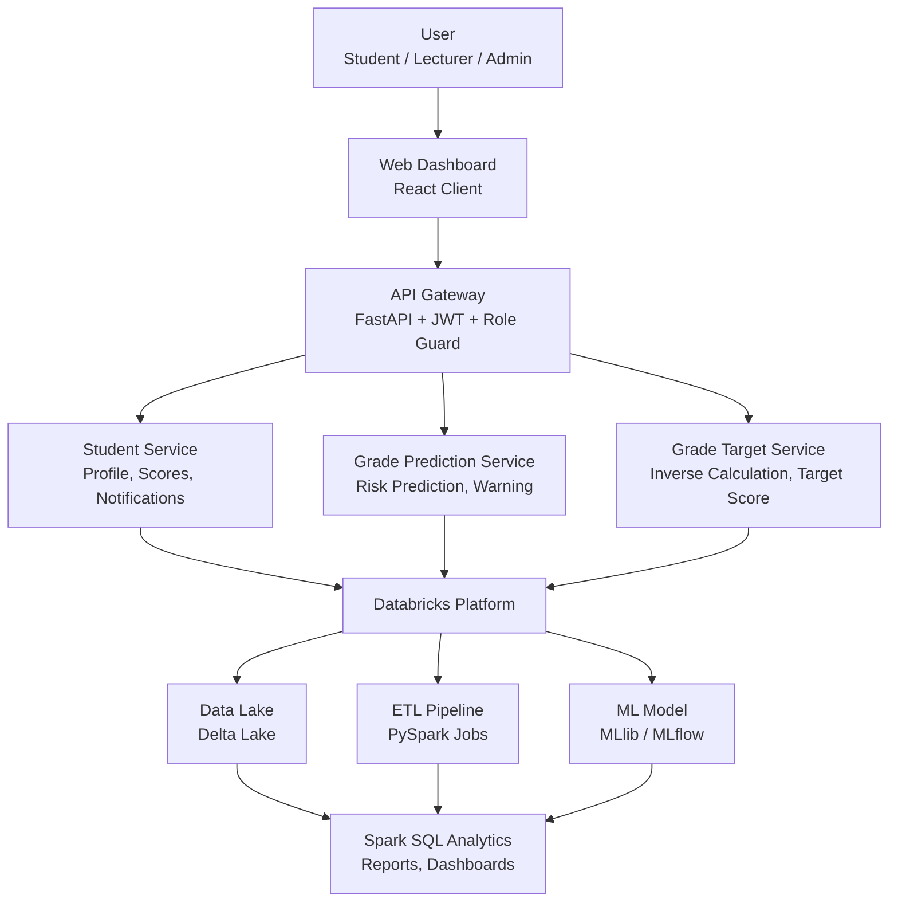

# PROJECT PROPOSAL

# SMARTGPA - Academic Analytics & Grade Prediction Platform

## 1. Thông Tin Chung

<<<<<<< HEAD
| STT | Họ và tên                        | MSSV      | Vai trò                        |
|-----|----------------------------------|-----------|------------------------------- |
| 1   | Nguyễn Thị Quỳnh Trang           |           | Leader / SOA Backend Architect |
| 2   | Vũ Ngọc Thu Phương               | [MSSV]    | Data Engineer                  |
| 3   | Phan Trần Thảo Vy                | 23670631  | ML / Cloud Engineer            |
| 4   | Lê Hoàng D                       | [MSSV]    | Frontend Developer             |
| 5   | Phạm Minh E                      | [MSSV]    | QA / Data Analyst              |
=======
### 1.1 Thành viên nhóm
>>>>>>> develop

| STT | Họ và tên | MSSV | Vai trò |
| --- | --- | --- | --- |
| 1 | Nguyễn Thị Quỳnh Trang | 23676071 | Leader / SOA Backend Architect |
| 2 | Vũ Ngọc Thu Phương | 23696981 | Data Engineer |
| 3 | Phan Trần Thảo Vy | 23670631 | ML / Cloud Engineer |
| 4 | Ngô Phước Thiên | 23670311 | Frontend Developer |
| 5 | Trương Thế Hải Thịnh | 23725051 | QA / Data Analyst |

**Git Repository:** [https://github.com/mangcutxinh/Smart-GPA](https://github.com/mangcutxinh/Smart-GPA)

### 1.2 Cấu trúc nhánh Git

<<<<<<< HEAD
| Nhánh                        | Chức năng/Module                                            | Người phụ trách             |
|------------------------------|-------------------------------------------------------------|-----------------------------|
| `feature/auth-gateway`       | Xác thực, phân quyền JWT (4 vai trò), API Gateway           | Chan                        |
| `feature/databricks-pipeline`| Hạ tầng Delta Lake, Pipeline ETL nạp điểm thô               | Vũ Ngọc Thu Phương          |
| `feature/simulation-engine`  | Logic core tính điểm đảo (LT/TH/Tích hợp)                   | Chan                        |
| `feature/ml-prediction`      | MLflow Model dự báo rớt môn (Điểm F)                        | Phan Trần Thảo Vy           |
| `feature/client-portal`      | Giao diện Web UI tích hợp thanh trượt giả lập               | Lê Hoàng D                  |
| `feature/analytics-dashboard`| Kiểm thử Pytest & Databricks SQL Dashboard                  | người bí ẩn                 |
| `develop`                    | Tích hợp tất cả các feature branch (code ổn định đã review) | Cả nhóm                     |
| `main`                       | Push cuối cùng – Bản hoàn chỉnh để nộp & deploy             | Cả nhóm                     |

> **Quy trình làm việc:**
> - Mỗi thành viên làm việc trên nhánh `feature/*` được phân công.
> - Khi hoàn thành module tạo PR vào `develop`, leader review & approve.
> - Chỉ merge duy nhất 1 lần vào `main` khi toàn hệ thống ổn định, không commit trực tiếp vào `main`.

---

# MÔ TẢ DỰ ÁN: SMARTGPA – HỆ THỐNG PHÂN TÍCH HỌC THUẬT, GIẢ LẬP ĐIỂM MỤC TIÊU VÀ DỰ BÁO CẢNH BÁO HỌC VỤ

## 1. Ý TƯỞNG DỰ ÁN (THE VISION)

**Tổng quan nền tảng**

Trong kỷ nguyên giáo dục số, việc kết nối dữ liệu học thuật giữa Nhà trường và Sinh viên thường gặp tình trạng rời rạc, thiếu tính dự báo thời gian thực. SmartGPA ra đời nhằm đồng bộ hóa và tự động hóa toàn bộ quá trình giả lập điểm số, cảnh báo rớt môn và hỗ trợ cố vấn học vụ.

**3 Trụ cột kỹ thuật của SmartGPA:**

* **Service-Oriented Architecture (SOA):** Tách biệt module giao diện, backend API và pipeline dữ liệu – vận hành linh hoạt quy mô trường lớn.
* **Inverse Calculation Engine:** Thuật toán tính điểm đảo linh động, tự động nhận diện loại học phần và số hóa logic tính điểm, đặc biệt đáp ��ng quy chế mới về SỐ ĐẦU ĐIỂM và ĐIỂM LIỆT.
* **Predictive Analytics Table:** Tự động hóa kiểm thử, phân tích dự báo qua từng layer (Bronze, Silver, Gold), vận hành trên Databricks Lakehouse.

---

## 2. VAI TRÒ NGƯỜI DÙNG & PHÂN QUYỀN

Hệ thống phân quyền theo vai trò: Sinh viên, Giảng viên, Cố vấn, Quản trị viên – kiểm soát truy cập và workflow nghiệp vụ cho từng đối tượng trên từng module.

---

## 3. CHI TIẾT NGHIỆP VỤ & QUY CHẾ TÍNH ĐIỂM

### 3.1. SỐ HÓA QUY CHẾ ĐẦU ĐIỂM THƯỜNG KỲ VÀ ĐIỂM LIỆT

- **Số đầu điểm Thường kỳ (TK) tỉ lệ chặt với số tín chỉ:**
  - 2 tín chỉ (LT/TH): 2 đầu điểm TK (TK_1, TK_2); ĐTB = (TK_1 + TK_2)/2
  - 3 tín chỉ (LT/TH): 3 đầu điểm TK (TK_1, TK_2, TK_3); ĐTB = (TK_1 + TK_2 + TK_3)/3
  - Môn tích hợp (VD: 2TC LT + 1TC TH): Tách riêng điểm LT, điểm TH đúng số chỉ

- **Điểm liệt thực hành:**
  - Nếu điểm TB thực hành < 3.0 ở môn tích hợp/thực hành, kết quả cuối luôn là F, trạng thái trả về CANH BAO: LIET THUC HANH (ROT MON).
  - Trường hợp này, mọi phép tính, giả lập đều trả về loại F – không cho tính điểm thành phần lý thuyết khi TH đang liệt.
  
- **Mặc định phần mềm khóa tính toán điểm cuối kỳ nhánh lý thuyết khi TH liệt, cho tới lúc TH ≥ 3.0.**

### 3.2. Quy chế tính điểm chi tiết (Cập nhật 2024 – số hóa theo tín chỉ & điểm liệt TH)

1. **Học phần Lý thuyết:**
   - ĐTB_TK = Tổng các điểm thường kỳ / số cột đầu điểm (tùy số tín chỉ, ví dụ 2 chỉ → 2 cột, 3 chỉ → 3 cột)
   - T = 20% × ĐTB_TK + 30% × Điểm giữa kỳ + 50% × Điểm cuối kỳ

2. **Học phần Thực hành:**
   - ĐTB_TH = Trung bình cộng điểm thực hành từng bài/tiết đúng số tín chỉ
   - T = ĐTB_TH
   - Nếu ĐTB_TH < 3.0 → Loại F bất chấp các điều kiện khác; trạng thái trả về: **CANH BAO: LIET THUC HANH (ROT MON)**

3. **Học phần Tích hợp (LT + TH):**
   - Kiểm tra trước: Nếu ĐTB_TH < 3.0 → luôn trả về F, khóa thực hiện phép toán tổng kết (Không cho phép giả lập/ước lượng điểm LT khi TH liệt)
   - Nếu đủ điều kiện, T = ((Điểm LT × Số chỉ LT) + (ĐTB_TH × Số chỉ TH)) / (Tổng số chỉ học phần)

### 3.3. Quy đổi thang điểm chữ (theo đúng Databricks code)

- A+: >= 9.0
- A:  >= 8.5
- B+: >= 8.0
- B:  >= 7.0
- C+: >= 6.0
- C:  >= 5.5
- D+: >= 5.0
- D:  >= 4.0
- **F:** < 4.0 HOẶC < 3.0 ĐTB_TH với môn có thực hành (bao gồm tích hợp/thực hành đơn thuần)

---

# State Machine – Vòng đời của một bản ghi điểm số
=======
| Nhánh | Chức năng / Module | Người phụ trách |
| --- | --- | --- |
| `feature/auth-gateway` | Xác thực JWT, phân quyền, API Gateway | Nguyễn Thị Quỳnh Trang |
| `feature/student-service` | Quản lý hồ sơ sinh viên, tra cứu điểm cá nhân | Nguyễn Thị Quỳnh Trang |
| `feature/grade-prediction-service` | Dự báo nguy cơ rớt môn, cảnh báo học vụ | Phan Trần Thảo Vy |
| `feature/grade-target-service` | Tính điểm mục tiêu, giả lập điểm cuối kỳ | Nguyễn Thị Quỳnh Trang |
| `feature/databricks-pipeline` | Delta Lake, PySpark ETL, bảng Bronze/Silver/Gold | Vũ Ngọc Thu Phương |
| `feature/client-dashboard` | Web Dashboard cho Student/Lecturer/Admin | Ngô Phước Thiên |
| `feature/analytics-dashboard` | Spark SQL Analytics, test tích hợp, báo cáo | Trương Thế Hải Thịnh |
| `develop` | Tích hợp các module đã review | Cả nhóm |
| `main` | Bản ổn định để nộp và demo | Cả nhóm |

---

## 2. Mô Tả Dự Án

SmartGPA là hệ thống phân tích học thuật và giả lập điểm mục tiêu cho sinh viên. Hệ thống cho phép giảng viên tải file điểm quá trình, tự động xử lý dữ liệu trên Databricks, lưu trữ theo mô hình Delta Lake, dự báo nguy cơ học vụ bằng MLlib và cung cấp công cụ để sinh viên biết cần đạt bao nhiêu điểm cuối kỳ để chạm tới điểm chữ mong muốn.

Mục tiêu chính của dự án:

- Xây dựng kiến trúc hướng dịch vụ gồm Web Dashboard, API Gateway và các service nghiệp vụ độc lập.
- Chuẩn hóa luồng dữ liệu điểm học phần từ file CSV đến Data Lake.
- Tính toán điểm quá trình, điểm mục tiêu và cảnh báo học vụ theo quy chế đào tạo.
- Tích hợp Databricks Platform cho ETL, MLlib và Spark SQL Analytics.
- Cung cấp dashboard phân tích cho sinh viên, giảng viên và quản trị viên.

---

## 3. Vai Trò Người Dùng

| Vai trò | Tên hệ thống | Quyền chính |
| --- | --- | --- |
| Sinh viên | Student | Xem điểm cá nhân, chọn điểm chữ mục tiêu, nhận gợi ý điểm cuối kỳ cần đạt, xem cảnh báo học vụ. |
| Giảng viên | Lecturer | Upload file điểm CSV, xem danh sách lớp học phần, cập nhật điểm thành phần, theo dõi cảnh báo của lớp. |
| Quản trị học vụ | Academic Admin | Theo dõi dashboard toàn trường, xem danh sách sinh viên có nguy cơ, quản lý báo cáo học vụ. |
| Admin hệ thống | System Admin | Quản lý tài khoản, phân quyền, cấu hình môn học, cấu hình thang điểm và tham số hệ thống. |

---

## 4. Kiến Trúc Tổng Thể

SmartGPA được thiết kế theo kiến trúc SOA. Web Dashboard không xử lý nghiệp vụ trực tiếp mà gửi request về API Gateway. API Gateway điều phối đến ba service chính: Student Service, Grade Prediction Service và Grade Target Service. Các service này đọc/ghi dữ liệu thông qua Databricks Platform, nơi vận hành Data Lake, ETL Pipeline, ML Model và Spark SQL Analytics.

### 4.1 Sơ đồ kiến trúc dạng khối

```text
                    User
                     |
                     v
              Web Dashboard
                     |
                     v
                API Gateway
                     |
       +-------------+-------------+
       v             v             v

  Student      Grade Prediction   Grade Target
  Service          Service          Service

       |             |              |
       +-------------+--------------+
                     |
                     v

             Databricks Platform
                     |
       +-------------+-------------+
       v             v             v

  Data Lake     ETL Pipeline      ML Model
 (Delta Lake)    (PySpark)        (MLlib)
>>>>>>> develop

                     |
                     v

              Spark SQL Analytics
```

### 4.2 Sơ đồ kiến trúc Mermaid


```mermaid
flowchart TD
    User["User<br/>Student / Lecturer / Admin"]
    Web["Web Dashboard<br/>React Client"]
    Gateway["API Gateway<br/>FastAPI + JWT + Role Guard"]

    StudentSvc["Student Service<br/>Profile, Scores, Notifications"]
    PredictionSvc["Grade Prediction Service<br/>Risk Prediction, Warning"]
    TargetSvc["Grade Target Service<br/>Inverse Calculation, Target Score"]

    Databricks["Databricks Platform"]
    Lake["Data Lake<br/>Delta Lake"]
    ETL["ETL Pipeline<br/>PySpark Jobs"]
    ML["ML Model<br/>MLlib / MLflow"]
    SQL["Spark SQL Analytics<br/>Reports, Dashboards"]

    User --> Web --> Gateway
    Gateway --> StudentSvc
    Gateway --> PredictionSvc
    Gateway --> TargetSvc

    StudentSvc --> Databricks
    PredictionSvc --> Databricks
    TargetSvc --> Databricks

    Databricks --> Lake
    Databricks --> ETL
    Databricks --> ML

    Lake --> SQL
    ETL --> SQL
    ML --> SQL
```

---

## 5. Thành Phần Hệ Thống

### 5.1 Web Dashboard

<<<<<<< HEAD
Quản lý vòng đời tài khoản và phân quyền truy cập cho hệ thống hướng dịch vụ. Hỗ trợ xác thực tập trung cho **4 vai trò** bằng cơ chế mã hóa mật khẩu bảo mật.
=======
Web Dashboard là giao diện chính cho người dùng. Sinh viên xem điểm, chọn mục tiêu điểm chữ và nhận kết quả giả lập. Giảng viên upload CSV và theo dõi lớp học phần. Admin xem thống kê, cảnh báo học vụ và báo cáo phân tích.
>>>>>>> develop

### 5.2 API Gateway

<<<<<<< HEAD
Thiết lập hạ tầng xử lý dữ liệu lớn trên nền tảng **Databricks 3.2**. Xây dựng quy trình xử lý dữ liệu Medallion (Bronze: Lưu log file điểm thô; Silver: Làm sạch/tính toán điểm thành phần, chuẩn hoá quy chế; Gold: Bảng điểm đa thang chuẩn), ETL kiểm thử tự động.
=======
API Gateway dùng FastAPI để tập trung xác thực, phân quyền và định tuyến request. Gateway kiểm tra JWT, xác định vai trò người dùng và chuyển request đến service phù hợp.
>>>>>>> develop

Chức năng chính:

<<<<<<< HEAD
Phát triển hệ thống API tính toán thời gian thực bằng **FastAPI**. Khi sinh viên kích hoạt thanh trượt chọn điểm chữ mục tiêu (A+ đến D), module này sẽ tự động kiểm tra điểm thành phần để tư vấn ngược số điểm cần đạt các kỳ vọng và nhận diện mọi trường hợp liệt.
=======
- Đăng nhập, refresh token, xác thực JWT.
- Kiểm tra quyền theo vai trò Student/Lecturer/Admin.
- Nhận file upload từ giảng viên.
- Gọi Databricks Jobs API để kích hoạt ETL.
- Cung cấp API cho dashboard và công cụ giả lập.
>>>>>>> develop

### 5.3 Student Service

<<<<<<< HEAD
Sử dụng Databricks Notebook để huấn luyện mô hình phân loại (Random Forest/XGBoost) dựa trên tập dữ liệu lịch sử điểm số sinh viên khóa cũ. Đóng gói mô hình & inference serverless.
=======
Student Service quản lý dữ liệu sinh viên, hồ sơ học tập, điểm cá nhân và thông báo học vụ.
>>>>>>> develop

Chức năng chính:

<<<<<<< HEAD
Phát triển giao diện ứng dụng Web UI responsive bằng React.js / Next.js chia làm 4 phân hệ cổng thông tin (Student, Lecturer, Advisor, Admin). Tích hợp các bộ kéo trượt giả lập và dashboard phân tích học vụ linh hoạt.
=======
- Tra cứu điểm theo `student_id`.
- Lấy danh sách môn học đã có dữ liệu điểm.
- Hiển thị trạng thái cảnh báo học vụ.
- Nhận notification khi giảng viên upload hoặc chỉnh sửa điểm.
>>>>>>> develop

### 5.4 Grade Prediction Service

<<<<<<< HEAD
Xây dựng tập dữ liệu lớn giả lập (Mock data) của 5.000 sinh viên để thực hiện load test hệ thống. Viết bộ mã kiểm thử tự động Pytest (Integration Test) để kiểm chứng toàn bộ flow nghiệp vụ.
=======
Grade Prediction Service dự báo nguy cơ rớt môn dựa trên điểm quá trình, điểm thực hành, điểm giữa kỳ và lịch sử học tập. Service này sử dụng kết quả từ mô hình MLlib/MLflow trên Databricks.
>>>>>>> develop

Chức năng chính:

- Gửi đặc trưng điểm số sang ML Model.
- Nhận xác suất nguy cơ rớt môn.
- Gắn nhãn `An toan`, `Nguy co`, hoặc `Nguy co cao`.
- Cung cấp dữ liệu cảnh báo cho dashboard.

### 5.5 Grade Target Service

Grade Target Service thực hiện tính toán điểm mục tiêu. Khi sinh viên chọn điểm chữ mong muốn như A, B+, C, service tính ngược điểm cuối kỳ tối thiểu cần đạt.

<<<<<<< HEAD
* Hệ thống xác thực đăng ký/đăng nhập phân quyền rõ ràng cho 4 vai trò bằng mã hóa bảo mật JWT.
* **Giảng viên:** Cấu hình thuộc tính học phần (Số tín chỉ lý thuyết, thực hành) và upload file điểm thành phần.
* **Sinh viên:** Tra cứu điểm thành phần hiện tại, kéo trượt giả lập mục tiêu để nhận ngay gợi ý điểm thi cần đạt.
* **Hệ thống xử lý đám mây:** Đồng bộ hóa quy chế tính điểm 3 loại học phần (Lý thuyết, Thực hành, Tích hợp), làm tròn điểm số đến 0.1 và tự động cảnh báo học vụ.
* Tự động hiển thị nhãn `Cảnh báo học vụ` nếu điểm số dự báo rơi vào thang điểm loại F (0.0 - 3.9).
=======
Chức năng chính:
>>>>>>> develop

- Đọc điểm quá trình từ Gold Table.
- Áp dụng công thức theo loại học phần: lý thuyết, thực hành, tích hợp.
- Tính `diem_cuoi_ky_can_dat`.
- Kiểm tra tính khả thi nếu điểm cần đạt vượt quá 10.

### 5.6 Databricks Platform

Databricks Platform là lõi xử lý dữ liệu lớn của hệ thống.

<<<<<<< HEAD
* Dashboard phân tích nâng cao, so sánh hiệu suất học tập và phổ điểm giữa các khóa học hoặc các khoa đào tạo với nhau.

---

### 2. Yêu cầu Phi chức năng

* **Bảo mật & Tính nhất quán đám mây:**
  * Toàn bộ dữ liệu điểm số lưu trữ trên đám mây phải ứng dụng công nghệ Delta Lake để đảm bảo tính toàn vẹn dữ liệu thông qua cơ chế ACID Transaction.
  * Phân tách quyền truy cập dữ liệu nghiêm ngặt: Sinh viên tuyệt đối không có quyền chỉnh sửa dữ liệu điểm gốc trên Delta Lake, chỉ được quyền gửi yêu cầu giả lập/nguyện vọng qua backend API.

* **Hiệu năng:**
  * Điểm chạm API phục vụ giả lập điểm thời gian thực (Simulation Request) phải đạt tốc độ xử lý và phản hồi dưới 150ms để đảm bảo trải nghiệm người dùng tối ưu.

* **Tính bảo trì:**
  * Source code Backend FastAPI tổ chức theo kiến trúc phân tầng chuẩn dịch vụ (Router → Service → Databricks Call Layer), độc lập hoàn toàn với mã nguồn tính toán.

---

### 3. Mô hình Thực thể Dữ liệu (Lược đồ mức Logic trên Delta Lake)

Hệ thống lưu trữ cấu trúc hóa dữ liệu trên Delta Lake thông qua 5 thực thể cốt lõi:

| **Thực thể dữ liệu** | **Mô tả các trường thông tin chính** |
=======
| Thành phần | Vai trò |
>>>>>>> develop
| --- | --- |
| Data Lake | Lưu dữ liệu điểm theo Delta Lake, đảm bảo ACID và truy vấn ổn định. |
| ETL Pipeline | Dùng PySpark để đọc CSV, chuẩn hóa schema, tính điểm quá trình và ghi Bronze/Silver/Gold. |
| ML Model | Dùng MLlib/MLflow để huấn luyện và phục vụ mô hình dự báo nguy cơ học vụ. |
| Spark SQL Analytics | Truy vấn báo cáo, thống kê phổ điểm, tỷ lệ cảnh báo và dashboard phân tích. |

---

## 6. Luồng Xử Lý Nghiệp Vụ

### 6.1 Luồng upload điểm

| Bước | Tác nhân | Mô tả |
| --- | --- | --- |
| 1 | Giảng viên | Đăng nhập Web Dashboard và chọn file CSV điểm quá trình. |
| 2 | API Gateway | Kiểm tra JWT, quyền Lecturer/Admin và validate định dạng CSV. |
| 3 | API Gateway | Lưu file upload và gọi Databricks Job theo `job_id`. |
| 4 | ETL Pipeline | PySpark đọc file CSV, ghi bảng Bronze. |
| 5 | ETL Pipeline | Làm sạch dữ liệu, kiểm tra điểm 0-10, tính điểm quá trình, ghi bảng Silver. |
| 6 | ETL Pipeline | Tính điểm mục tiêu, cảnh báo học vụ, ghi bảng Gold. |
| 7 | Spark SQL Analytics | Cập nhật dữ liệu cho dashboard báo cáo. |

### 6.2 Luồng sinh viên giả lập điểm mục tiêu

| Bước | Tác nhân | Mô tả |
| --- | --- | --- |
| 1 | Sinh viên | Đăng nhập và chọn môn học cần xem. |
| 2 | Web Dashboard | Gửi `student_id`, `ma_mon`, `target_grade` đến API Gateway. |
| 3 | Grade Target Service | Lấy dữ liệu điểm từ Gold Table. |
| 4 | Grade Target Service | Tính điểm cuối kỳ cần đạt theo công thức học phần. |
| 5 | Web Dashboard | Hiển thị kết quả, cảnh báo nếu mục tiêu không khả thi. |

### 6.3 Luồng dự báo cảnh báo học vụ

| Bước | Thành phần | Mô tả |
| --- | --- | --- |
| 1 | ETL Pipeline | Chuẩn hóa điểm và tạo feature cho mô hình. |
| 2 | ML Model | Dự báo xác suất sinh viên có nguy cơ rớt môn. |
| 3 | Grade Prediction Service | Gắn nhãn cảnh báo theo ngưỡng xác suất. |
| 4 | Spark SQL Analytics | Tổng hợp tỷ lệ cảnh báo theo lớp, môn, khoa. |
| 5 | Web Dashboard | Hiển thị cảnh báo cho sinh viên, giảng viên và admin. |

---

## 7. Quy Chế Tính Điểm

### 7.1 Học phần lý thuyết

```text
T = 20% * DTB_Thuong_Ky + 30% * Diem_Giua_Ky + 50% * Diem_Cuoi_Ky
```

Khi sinh viên chọn điểm mục tiêu:

```text
Diem_Cuoi_Ky_Can_Dat = (Diem_Muc_Tieu - 0.2 * DTB_Thuong_Ky - 0.3 * Diem_Giua_Ky) / 0.5
```

### 7.2 Học phần thực hành

```text
T = Trung_Binh(Diem_Thuc_Hanh_1, Diem_Thuc_Hanh_2, ..., Diem_Thuc_Hanh_N)
```

Học phần thực hành không phụ thuộc điểm cuối kỳ lý thuyết. Hệ thống dùng điểm thực hành hiện tại để đánh giá trạng thái và cảnh báo.

### 7.3 Học phần tích hợp

```text
T = (Diem_Ly_Thuyet * So_Chi_LT + Diem_Thuc_Hanh * So_Chi_TH) / Tong_So_Chi
```

Điều kiện nghiệp vụ:

- Có đủ dữ liệu lý thuyết và thực hành.
- Điểm thực hành phải đạt ngưỡng tối thiểu 3.0.
- Nếu điểm cuối kỳ cần đạt lớn hơn 10.0, hệ thống đánh dấu mục tiêu không khả thi.

---

## 8. Thiết Kế Cơ Sở Dữ Liệu

Dữ liệu nghiệp vụ được tổ chức theo hai lớp: dữ liệu ứng dụng phục vụ xác thực và dashboard, dữ liệu phân tích lưu trên Delta Lake phục vụ ETL, ML và Spark SQL Analytics.

### 8.1 Danh sách bảng nghiệp vụ

| Bảng | Mục đích | Trường chính |
| --- | --- | --- |
| `users` | Lưu tài khoản hệ thống | `id`, `email`, `password_hash`, `full_name`, `role`, `is_active`, `created_at` |
| `students` | Hồ sơ sinh viên | `student_id`, `user_id`, `major_id`, `class_code`, `academic_year`, `gioi_tinh`, `ngay_sinh` |
| `lecturers` | Hồ sơ giảng viên | `lecturer_id`, `user_id`, `faculty_id`, `department` |
| `subjects` | Cấu hình môn học | `ma_mon`, `ten_mon`, `loai_hoc_phan`, `so_chi_lt`, `so_chi_th`, `tong_so_chi` |
| `class_sections` | Lớp học phần | `ma_lop_hoc_phan`, `ma_mon`, `lecturer_id`, `semester`, `school_year` |
| `enrollments` | Sinh viên trong lớp học phần | `id`, `student_id`, `ma_lop_hoc_phan`, `status` |
| `score_uploads` | Lịch sử upload file điểm | `upload_id`, `filename`, `lecturer_id`, `status`, `created_at`, `databricks_run_id` |
| `student_scores` | Điểm thành phần và trạng thái hiện tại | `score_id`, `student_id`, `ma_lop_hoc_phan`, `upload_id`, `diem_thong_thuong_list`, `diem_giua_ky`, `diem_cuoi_ky`, `diem_thuc_hanh_hien_tai`, `diem_thuc_hanh_tich_hop`, `diem_thuong_ky_lt_list`, `diem_giua_ky_lt`, `diem_tong_ket`, `diem_chu`, `diem_he_4`, `ket_qua`, `status_canh_bao` |
| `grade_targets` | Thang quy đổi điểm chữ | `grade_code`, `min_score_10`, `max_score_10`, `score_4`, `description` |
| `predictions` | Kết quả dự báo nguy cơ | `prediction_id`, `student_id`, `ma_mon`, `risk_probability`, `risk_label`, `model_version`, `created_at` |
| `notifications` | Thông báo in-app | `notification_id`, `user_id`, `title`, `message`, `type`, `is_read`, `created_at` |

### 8.2 Bảng Delta Lake trên Databricks

| Layer | Bảng | Nội dung |
| --- | --- | --- |
| Bronze | `bronze_diem_sinh_vien` | Dữ liệu CSV thô sau upload, giữ schema ban đầu và metadata file. |
| Silver | `silver_diem_sinh_vien` | Dữ liệu đã validate, chuẩn hóa kiểu dữ liệu, tính điểm quá trình. |
| Gold | `gold_du_bao_diem_cuoi_ky` | Dữ liệu phục vụ API, tính điểm mục tiêu, cảnh báo và dashboard. |
| Dimension | `dim_diem_muc_tieu` | Danh mục điểm chữ A+, A, B+, B, C+, C, D+, D, F. |
| Analytics | `fact_academic_warning` | Tổng hợp tỷ lệ cảnh báo theo môn, lớp, học kỳ. |

### 8.3 Sơ đồ ERD

```mermaid
erDiagram
<<<<<<< HEAD
    Users ||--o{ Class_Sections : "quản lý giảng dạy (lecturer)"
    Users ||--o{ Student_Scores : "tra cứu / giả lập (student)"
    Subjects ||--o{ Class_Sections : "phân loại cấu hình học phần"
    Class_Sections ||--o{ Student_Scores : "lưu trữ danh sách điểm lớp"
    Student_Scores }o--|| Score_Mapping : "ánh xạ quy đổi thang điểm chữ"
    Users {
=======
    users ||--o| students : "maps_to"
    users ||--o| lecturers : "maps_to"
    users ||--o{ notifications : "receives"

    lecturers ||--o{ class_sections : "teaches"
    lecturers ||--o{ score_uploads : "uploads"
    subjects ||--o{ class_sections : "opens"
    class_sections ||--o{ enrollments : "contains"
    students ||--o{ enrollments : "joins"

    class_sections ||--o{ student_scores : "has_scores"
    students ||--o{ student_scores : "owns_scores"
    score_uploads ||--o{ student_scores : "imports"

    subjects ||--o{ predictions : "predicts_for"
    students ||--o{ predictions : "has_predictions"
    grade_targets ||--o{ student_scores : "maps_grade"

    users {
>>>>>>> develop
        string id PK
        string email
        string password_hash
        string full_name
        string role
        boolean is_active
        timestamp created_at
    }

    students {
        string student_id PK
        string user_id FK
        string major_id
        string class_code
        string academic_year
        string gioi_tinh
        string ngay_sinh
    }

    lecturers {
        string lecturer_id PK
        string user_id FK
        string faculty_id
        string department
    }

    subjects {
        string ma_mon PK
        string ten_mon
        string loai_hoc_phan
        int so_chi_lt
        int so_chi_th
        int tong_so_chi
    }

    class_sections {
        string ma_lop_hoc_phan PK
        string ma_mon FK
        string lecturer_id FK
        string semester
        string school_year
    }

    enrollments {
        string id PK
        string student_id FK
        string ma_lop_hoc_phan FK
        string status
    }

    score_uploads {
        string upload_id PK
        string filename
        string lecturer_id FK
        string status
        string databricks_run_id
        timestamp created_at
    }

    student_scores {
        string score_id PK
        string student_id FK
        string ma_lop_hoc_phan FK
        string upload_id FK
        string diem_thong_thuong_list
        float diem_giua_ky
        float diem_cuoi_ky
        string diem_thuc_hanh_hien_tai
        float diem_thuc_hanh_tich_hop
        string diem_thuong_ky_lt_list
        float diem_giua_ky_lt
        float diem_tong_ket
        string diem_chu FK
        float diem_he_4
        string ket_qua
        string status_canh_bao
    }

    grade_targets {
        string grade_code PK
        float min_score_10
        float max_score_10
        float score_4
        string description
    }

    predictions {
        string prediction_id PK
        string student_id FK
        string ma_mon FK
        float risk_probability
        string risk_label
        string model_version
        timestamp created_at
    }

    notifications {
        string notification_id PK
        string user_id FK
        string title
        string message
        string type
        boolean is_read
        timestamp created_at
    }
```

---

## 9. Mô Hình Dữ Liệu Medallion Trên Databricks

### 9.1 Bronze Layer

Bronze lưu dữ liệu thô từ file upload, phục vụ audit và truy vết.

Trường chính:

- `student_id`
- `student_name`
- `ma_mon`
- `ten_mon`
- `ma_lop_hoc_phan`
- `loai_hoc_phan`
- `thuong_xuyen_1`, `thuong_xuyen_2`
- `giua_ky`
- `thuc_hanh_1`, `thuc_hanh_2`, `thuc_hanh_3`
- `source_file`
- `ingested_at`

### 9.2 Silver Layer

Silver chuẩn hóa dữ liệu và tính điểm quá trình.

Trường chính:

- Các trường định danh từ Bronze.
- `tong_so_chi`
- `lt_qt_10`
- `th_qt_10`
- `qt_10`
- `data_quality_status`

### 9.3 Gold Layer

Gold là lớp phục vụ API và dashboard.

Trường chính:

- `student_id`, `ma_mon`, `ma_lop_hoc_phan`
- `qt_10`
- `diem_chu_muc_tieu`
- `diem_muc_tieu_10`
- `diem_cuoi_ky_can_dat`
- `kha_thi`
- `risk_probability`
- `status_canh_bao`

---

## 10. Yêu Cầu Chức Năng

### 10.1 Must Have

- Người dùng đăng nhập bằng email/password, nhận JWT và truy cập theo vai trò.
- Giảng viên upload file CSV điểm quá trình.
- Backend validate header, dữ liệu điểm và loại học phần.
- Backend gọi Databricks Job để chạy ETL.
- Databricks ghi Bronze/Silver/Gold Delta tables.
- Sinh viên tra cứu điểm cá nhân.
- Sinh viên chọn điểm chữ mục tiêu và nhận điểm cuối kỳ cần đạt.
- Admin xem dashboard Spark SQL Analytics.

### 10.2 Should Have

- ML Model dự báo xác suất nguy cơ rớt môn.
- Notification khi điểm mới được upload hoặc sinh viên rơi vào nhóm nguy cơ.
- Dashboard lọc theo lớp, môn, học kỳ, giảng viên.

### 10.3 Could Have

- So sánh phổ điểm giữa các lớp.
- Cảnh báo tự động khi tỷ lệ nguy cơ của lớp vượt ngưỡng.
- Gợi ý chiến lược học tập dựa trên điểm mục tiêu.

---

## 11. Yêu Cầu Phi Chức Năng

| Nhóm yêu cầu | Mô tả |
| --- | --- |
| Bảo mật | JWT, phân quyền theo role, không cho sinh viên chỉnh sửa dữ liệu điểm. |
| Toàn vẹn dữ liệu | Delta Lake bảo đảm ACID transaction, lưu được lịch sử upload và trạng thái xử lý. |
| Hiệu năng | API tra cứu và giả lập điểm phản hồi nhanh cho dashboard; ETL xử lý batch CSV trên Databricks. |
| Khả mở rộng | Tách service rõ ràng, có thể mở rộng riêng Prediction Service hoặc Target Service. |
| Khả quan sát | Lưu `databricks_run_id`, trạng thái upload và log xử lý để debug pipeline. |
| Bảo trì | Backend tổ chức theo Router -> Service -> Databricks Layer; notebook PySpark tách khỏi API. |

---

## 12. Kế Hoạch Kiểm Thử

| Mã TC | Module | Kịch bản | Kết quả mong đợi |
| --- | --- | --- | --- |
| TC-01 | Auth Gateway | Gọi endpoint yêu cầu giả lập điểm nhưng truyền token hết hạn hoặc sai quyền | Hệ thống trả về mã lỗi `401 Unauthorized` hoặc `403 Forbidden`. |
| TC-02 | Ingestion Service | Giảng viên upload file danh sách điểm định dạng không hợp lệ | Hệ thống chặn từ tầng Gateway, trả về `422 Unprocessable Entity`. |
| TC-03 | Data Rounding | Điểm tổng kết thực tế tính ra là 8.44 hoặc 8.46 | Databricks xử lý lưu vào Silver Table làm tròn chính xác thành 8.4 và 8.5. |
| TC-04 | Grade Mapping | Điểm học phần tính ra đạt mốc 8.0 | Hệ thống tự động map chính xác sang điểm hệ chữ **B+** và hệ 4 là **3.5** theo đúng `image_4.png`. |
| TC-05 | Inverse Calc (LT) | Môn Lý thuyết: Điểm TK=8.0, GK=9.0; Chọn mục tiêu đạt loại **A** (Mốc 8.5) | Simulation Engine tính đảo, trả về kết quả điểm cuối kỳ cần đạt |
| TC-06 | Inverse Calc (TH) | Môn Tích hợp (2 chỉ LT, 1 chỉ TH): Điểm thực hành=8.0; Chọn mục tiêu đạt loại **A** (Mốc 8.5) | Simulation Engine tính toán đảo, thông báo sinh viên cần đạt mức tối thiểu ở các nhánh |
| TC-07 | Feasibility Alert | Sinh viên điểm hiện tại quá thấp, chọn mục tiêu đạt loại **A+** | Hệ thống nhận diện điểm cuối kỳ cần đạt > 10.0, hiện thông báo không khả thi |
| TC-08 | ML Prediction | Sinh viên có điểm giữa kỳ và thường kỳ dưới mốc 3.5 | MLflow Endpoint ghi nhận dữ liệu, trả về xác suất nguy cơ rớt môn cao (>70%). |
| TC-09 | Analytics | Admin mở dashboard | Hiển thị tỷ lệ cảnh báo theo môn/lớp/học kỳ. |

---

## 13. Kết Quả Demo Dự Kiến

- Web Dashboard có ba luồng chính: Student, Lecturer, Admin.
- Giảng viên upload CSV và nhận `databricks_run_id`.
- Databricks Workflows hiển thị job ETL chạy thành công.
- Delta tables được tạo trong schema `workspace.smartgpa_db`.
- Sinh viên tra cứu điểm và xem điểm cuối kỳ cần đạt.
- Admin xem Spark SQL Analytics về cảnh báo học vụ.

---

## 14. Câu Hỏi Phản Biện Dành Cho Hội Đồng

1. Với dữ liệu điểm học tập tăng theo từng học kỳ, nên partition Delta Lake theo `school_year`, `semester`, `ma_lop_hoc_phan` hay dùng Z-Ordering theo `student_id` và `ma_mon` để tối ưu tra cứu cá nhân?
2. Grade Target Service nên tính trực tiếp bằng FastAPI để phản hồi nhanh hay đẩy toàn bộ logic tính điểm mục tiêu vào Databricks Serverless để thống nhất với pipeline dữ liệu?
3. Với mô hình MLlib dự báo nguy cơ rớt môn, nhóm nên chọn ngưỡng cảnh báo cố định theo xác suất hay điều chỉnh ngưỡng theo từng môn học/lớp học phần?

---

## 15. Tiến độ thực tế & Kết quả tích hợp

SmartGPA đã được triển khai đầy đủ và tích hợp thành công trên môi trường thực tế với các kết quả cụ thể:

### 15.1 Backend & Cloud Integration (FastAPI + Databricks SQL)
- **Tích hợp Databricks SQL**: Kết nối trực tiếp đến Databricks SQL Warehouse thông qua schema `smartgpa_db` và token cá nhân hoạt động ổn định.
- **Cơ chế Fallback thông minh (Fail-safe)**: Hàm `lay_diem_sinh_vien_tu_cloud` hỗ trợ truy vấn tầng Gold trước, nếu bảng chưa khả dụng sẽ tự động truy xuất bảng Silver và ánh xạ động các trường điểm, và tự động chuyển về Mock Database local khi mất kết nối mạng.
- **Ánh xạ mã môn (Curriculum Code Mapping)**: Tự động chuyển đổi các mã môn số từ file Excel của trường (như `2101680`, `2101409`, `2101435`) sang mã môn nội bộ (`INT1001`, `INT1306`, `INT1410`) khi upload, giải quyết triệt để vấn đề lệch mã môn mà không phá vỡ kiểm thử hay giao diện.
- **API Cảnh báo học vụ**: Endpoint `/simulation/warnings` lấy dữ liệu cảnh báo học vụ thực tế của sinh viên trực tiếp từ Databricks SQL, đồng thời chạy mô hình Random Forest dự đoán xác suất rớt môn.

### 15.2 Giao diện người dùng cao cấp (React Vite App)
- **Thiết kế Soft Glassmorphism**: Toàn bộ giao diện áp dụng tone màu kem vani ngọt ngào (`#FAF6F0`), các viền kính mờ phản chiếu ánh sáng hồng tulip dịu mắt giúp giảm mỏi mắt cho người dùng.
- **Tương tác 4 vai trò E2E**:
  - *Sinh viên*: Chạy giả lập điểm thi cuối kỳ real-time theo mức điểm chữ mục tiêu (A, B+, B, C+, C, D+, D, F) qua thanh trượt tùy chỉnh cực nhạy.
  - *Giảng viên*: Upload file điểm quá trình CSV trực tiếp lên FastAPI Server và nhận phản hồi tức thì.
  - *Cố vấn học thuật*: Theo dõi danh sách sinh viên thuộc diện cảnh báo học vụ từ Cloud Databricks.
  - *Quản trị viên*: Xem các thống kê tổng quan, đổi điểm số sinh viên, và cập nhật cấu hình quy chế chấm điểm.

### 15.3 Kiểm thử & Chất lượng
- Chạy toàn bộ **60 bài test kiểm thử tích hợp (Pytest)** đạt tỷ lệ pass **100%**, đảm bảo các luồng nghiệp vụ và logic tính điểm không bị lỗi hồi quy (regression errors).
- Trình biên dịch TypeScript và Vite hoàn tất quá trình đóng gói production assets (`dist/`) với **0 lỗi và 0 cảnh báo**.

### 15.4 Khởi tạo dữ liệu Excel nhập điểm mẫu (Class A & B)
- Đóng gói đầy đủ dữ liệu điểm của 39 môn học từ học kỳ 1 đến học kỳ 9 cho hai lớp **DHKHDL19A** (50 sinh viên) và **DHKHDL19B** (48 sinh viên) dưới định dạng file Excel chuẩn của trường: `[Mã môn]_[Tên môn]_BangDiem.xlsx`.
- Dữ liệu điểm học kỳ 8 tự động chừa trống cột điểm thi cuối kỳ, trong khi học kỳ 9 trống hoàn toàn để phục vụ demo trực quan luồng tính điểm mục tiêu.

